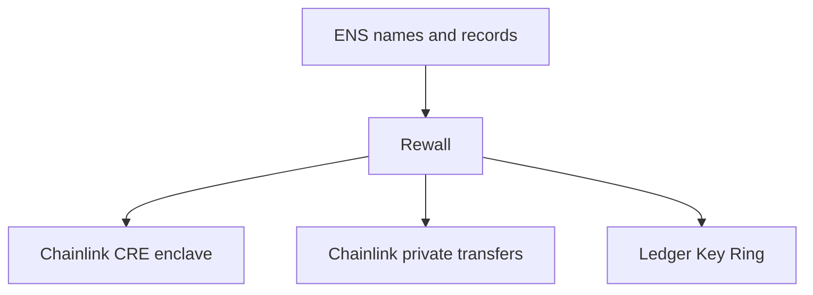

# Built with

Rewall stands on three partners. ENS is the ground it is built on. Chainlink opens a secret inside a
secure enclave and carries private payments. Ledger approves a machine joining a key ring with a
button press. This page says what each one is, what Rewall does with it, and what is real today
versus what is simulated. The code in the repo is the source for every claim here.

Everything runs on Sepolia, the Ethereum test network. Real credentials do not belong in it.

## ENS

ENS is the Ethereum Name Service. It turns a readable name like `alice.eth` into an address, and
lets that name hold small named strings called text records. ENSv2 is the new version of the system.
Rewall runs on its beta on Sepolia.

Rewall uses ENS for everything. Each person, team or machine is a name. It publishes one public key
as a text record called `rewall.pubkey`. Each secret is a subname, `<secret>.rewall.<name>.eth`, and
its encrypted value sits in a record called `rewall.blob`. Each reader gets a sealed copy of the data
key in a record called `rewall.key.<fingerprint>`. There is no database anywhere else.

The contracts matter too. Every account owns one `PermissionedResolver`, deployed once through
`VerifiableFactory` and reused for every secret. Reads go through `UniversalResolverV2`. Write
permission uses ENSv2 Enhanced Access Control, so an owner can let another wallet write one secret's
records without handing over the name. Read permission is not a permission at all. It is holding a
sealed copy.

All of this is real. Every read and write in the repo goes to the live ENSv2 contracts on Sepolia.
Nothing is mocked and no address is guessed. See [Built on ENSv2](/ensv2) for the contracts, the
roles and the addresses.

## Chainlink

Chainlink gives Rewall two things. One opens a secret inside an enclave. The other carries private
payments.

### CRE Confidential Workflow

CRE is the Chainlink Runtime Environment. A workflow is a small program run by Chainlink's network
of nodes. A Confidential Workflow runs part of that program inside an enclave, a sealed part of a
server that even its operator cannot look into.

Rewall uses one to solve an old problem. Any unattended job needs an identity key on its machine,
and read access in Rewall can never be taken back. An enclave changes that. It gets its own ENS
name, `enclave.rewall-test-2.eth`, and publishes `rewall.pubkey` like anyone else. The owner grants
it a secret with an ordinary `grant`. The workflow reads the records off the chain, opens the secret
inside the enclave, and returns only a SHA-256 digest of the value. Revoking it is an ordinary
rotation. Nothing in the SDK knows an enclave exists.

What is real: the secret, its records and the grant on Sepolia, the enclave's name and key, and the
live read through `UniversalResolverV2`. The cryptography is real too, checked byte for byte against
libsodium and WebCrypto. What is not real: the enclave itself. `cre workflow simulate` runs the
handler on your machine and says so on every run. Deploying to a real Nitro enclave needs private
beta enrollment. See [Chainlink CRE](/components/cre).

### Private transfer service

Chainlink's Compliant Private Transfer demo is a payment service on Sepolia. You deposit tokens into
a vault, then move them between accounts with signed messages that never touch the chain. A
recipient can hand out a shielded address, a fresh address that leads nowhere on chain. Withdrawals
come back as tickets the vault checks. It moves ERC-20 tokens only.

Rewall builds three things on it. A name publishes a shielded address as `rewall.shielded`, so
anyone can pay a name privately. After a payment the sender writes an encrypted receipt secret and
grants it to whoever should know. And a shared treasury is just a signing key stored as a secret.
See [Pay a name](/examples/06-pay-a-name).

The deployed service at `convergence2026-token-api.cldev.cloud` still authenticates requests but no
longer credits deposits, because its indexer is not running. So the repo carries `rail/`, a local
copy of the missing half that speaks the same wire format. On Sepolia it deploys its own vault
contract, a stand-in for Chainlink's with the same events and ticket format. It also deploys a
Chainlink ACE policy engine, the contract the vault asks before it moves anything. The token is a
real ERC-20, Circle's Sepolia USDC unless `TOKEN_ADDRESS` names another. Balances and shielded
address mappings live in a local SQLite file. The rail is a test stand-in and is not part of Rewall.
See [Transfer rail](/components/rail).

## Ledger

Ledger makes hardware wallets. Its Key Ring is a group of keys that can encrypt for all of its
members. Joining the ring is approved on the device itself. The Ledger shows the request on its own
screen and a person presses a button. Software on the host cannot press that button.

Rewall uses it to enrol a server that has no USB port. The owner mints a member key on the machine
that has the device. The device approves it. Then the member is stored as a Rewall secret,
`ledger-ring.rewall.<owner>`, granted to the server's ENS name. The server reads it off the chain
and joins the ring with no device attached. Removing that server is a rotation.

Real: the actual Key Ring app, `app-ledger-sync`, compiled from Ledger's source. The device
commands, the signing and the trustchain blocks are real. Simulated: the device hardware. It runs in
Speculos, Ledger's own emulator, because no physical device was used. That has two consequences the
README states plainly. It runs against Ledger's staging trustchain, since production refuses a
self-compiled app. And Speculos is a development tool that must not back a real ring. See
[Ledger Key Ring](/components/ledger).

## What they have in common

Each partner solves one thing Rewall cannot solve alone. ENS is where names, keys and records live.
Chainlink opens a secret with no human present, and pays with no public transaction. Ledger gives a
human approval that malware cannot fake. In every case the ENS records are the real thing. The
simulated parts are the enclave, the device silicon, and the off chain half of the transfer service,
which `rail/` runs locally in place of Chainlink's.
