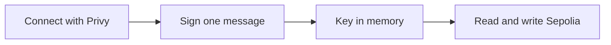

# Dashboard

The dashboard lives in `web/` and is served at [rewall.me](https://rewall.me). It is a Next.js app
where you store secrets, share them by ENS name, take them back, recover a lost wallet, hold 2FA
accounts and send private payments.

It reads and writes the Sepolia test network directly from the browser. There is no Rewall backend.
The few server routes it has exist to pay for a new user's setup, not to hold or see any secret.
Sepolia is a test network, so real credentials do not belong in it.

## Pages

| Route                  | What it shows                                                            |
| ---------------------- | ------------------------------------------------------------------------ |
| `/`                    | The landing page.                                                        |
| `/dashboard`           | Your vault at a glance.                                                  |
| `/dashboard/secrets`   | Every secret under your name. Store, reveal, share, revoke, rotate.      |
| `/dashboard/2fa`       | Your authenticator accounts with live codes. Pair the extension here.    |
| `/dashboard/transfers` | Pay a name privately and see receipts shared with you.                   |
| `/dashboard/recovery`  | Recover a vault whose wallet is lost, with guardians approving on chain. |
| `/dashboard/setup`     | A four step wizard for a wallet that has never used Rewall.              |

## Connecting a wallet

You connect through Privy, a wallet connection service. It offers a wallet, an email or a Google
login. Someone with no wallet gets an embedded one, which is a plain Ethereum account, the only kind
Rewall can derive a key from. The dashboard is fixed to Sepolia.

The first time, you sign one message and that signature becomes your key. On a wallet it has not
seen, the dashboard asks for the signature twice. It refuses a wallet that gives two different
answers, because a key that changes would make every secret unreadable next time. It remembers a
passing wallet in the browser, so later unlocks ask once.



The key stays in memory for the tab and is never stored. It is wiped when you lock, when you switch
wallets, and after fifteen minutes with no activity. Every decrypt and every write goes through one
in-memory `Rewall` client from the [SDK](/components/sdk). Pairing the extension hands that key over
the page, never the wallet.

## Server routes

| Route            | What it does                                                             |
| ---------------- | ------------------------------------------------------------------------ |
| `/api/account`   | Says whether a wallet has been seen before, so the wizard knows to open. |
| `/api/faucet`    | Sends a new wallet a little Sepolia ETH and USDC, once, with a cap.      |
| `/api/provision` | Registers a name and its resolver for a new user, paid by the project.   |
| `/api/rail`      | Forwards payment calls to the private transfer service.                  |

What they hold matters more than what they do. None of them sees a secret, a data key or an identity
key.

`/api/account` answers with booleans and the finished name only.

`/api/faucet` and `/api/provision` spend project money, so the caller must prove the wallet is
theirs. They check the Privy access token and accept only an address linked to that session. The
faucet sends `REWALL_DRIP_ETH` of Sepolia ETH and `REWALL_USDC_DRIP` of USDC once per wallet, and
stops at `REWALL_FAUCET_CAP_ETH` and `REWALL_USDC_CAP` in total.

`/api/provision` runs in two phases. `start` deploys a `PermissionedResolver` with the user's
`rewall.pubkey` and `rewall.recovery.pubkey` already written, deploys two `UserRegistry` contracts,
and commits to the name. `finish` registers the name once `MIN_COMMITMENT_AGE` has passed, registers
the `rewall` label, hands root on the registry to the user and revokes it from the project.
`REWALL_PROVISION_CAP` limits how many setups can ever run. The user sends no transaction of their
own. The `sponsor` proof in [Tools](/components/tools) checks the same flow from a script.

`/api/rail` is a hop. The browser cannot call the transfer service directly, because the service
sends no CORS headers, so the dashboard posts to `/api/rail/<endpoint>` and the route forwards the
already signed body. It accepts the five documented endpoints only, `/balances`, `/transactions`,
`/shielded-address`, `/private-transfer` and `/withdraw`. It holds no key, signs nothing, decrypts
nothing and reads no field.

## The sponsor wallet and MongoDB

The routes use a sponsor wallet and a local MongoDB, both set in `.env.local`. The sponsor is its
own wallet, `REWALL_SPONSOR_KEY`, and not the funder in `tools/.env`, because this one faces the
internet. `pnpm run sponsor-key` in `tools/` writes it into `web/.env.local` without printing it.

MongoDB runs on `127.0.0.1:27017` and holds one document per wallet, in the `accounts` collection of
the `rewall` database. It records when the wallet was first seen, the faucet legs it received, and
the name it chose. It also keeps the state of an unfinished setup, including the random
`commitSecret` the registrar needs to finish it. It never holds a secret or a key. The faucet caps
are summed from this ledger rather than kept in a counter, so a crash cannot lose spend.

## Running it

```bash
cd ../sdk && pnpm run build
cd ../web && pnpm install
cp .env.template .env.local     # fill in the Privy ids and the sponsor key
pnpm run dev                    # http://localhost:3000
```

Privy needs `NEXT_PUBLIC_PRIVY_APP_ID` and `NEXT_PUBLIC_PRIVY_CLIENT_ID` from its console, and
`PRIVY_APP_SECRET` so the server routes can verify a caller. MongoDB must be running for the faucet
and the wizard. Everything else works without either. The transfer pages need the
[rail](/components/rail) running, with `NEXT_PUBLIC_REWALL_VAULT` and `REWALL_RAIL_URL` set.

`NEXT_PUBLIC_SEPOLIA_LOGS_RPC_URL` is optional. ENSv2 answers which names a wallet owns only through
logs, so listing them needs an endpoint that keeps the whole history. Left blank, the dashboard asks
you to type the name.

## Checking it

The `check:*` scripts drive a real browser against a running server with a real wallet behind a
headless provider. They sign real messages and send real Sepolia transactions.

```bash
pnpm run build && pnpm run start
pnpm run check:dashboard        # in another shell
pnpm run check:create
pnpm run check:sharing
pnpm run check:recovery
```

There are more, such as `check:2fa`, `check:onboarding`, `check:transfers` and `check:landing`.
`pnpm run` with no argument lists them. The wallet they use comes from `tools/.env`. Screenshots go
to a temp folder, never into the repository.

## Fonts and icons

Everything the dashboard borrows is credited in `web/ATTRIBUTIONS.md`. Icons are unmodified white
SVGs from Arcticons under GPL-3.0. The fonts are Manrope, Lexend Deca, Akt and Ubuntu Mono, loaded
through `next/font/google` and self-hosted by Next.js. The ENS, Ethereum, Chainlink and Ledger marks
on the landing page name real integrations and do not imply endorsement. The licence texts sit in
`web/public/licenses/`.
