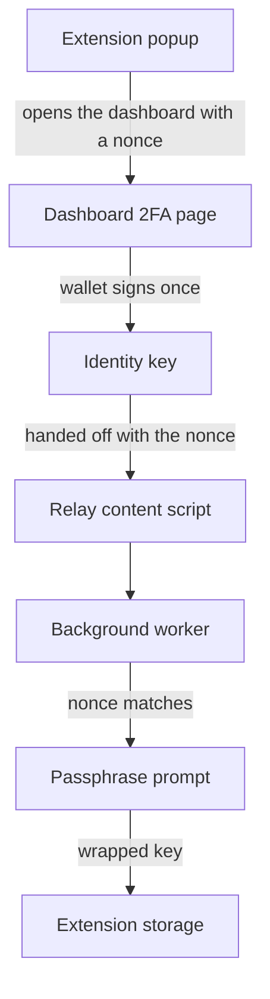

# Browser extension

Rewall 2FA fills sign-in codes. The codes come from `totp` secrets stored under your ENS name. One
build works in Chrome and one in Firefox. The source is in `extension/`.

A TOTP is a time-based one time password, the six digit code an authenticator app shows. Each
account is stored as the standard `otpauth://` setup URI, encrypted like any other secret, with
`rewall.site` holding the hostname it belongs to. Parsing lives in `@rewall/sdk/2fa`, a part of the
[SDK](/components/sdk) that needs neither viem nor libsodium.

## What it does

Nothing is sent to a Rewall server, because there is none. The extension reads your secrets straight
from Sepolia through the public RPC and computes codes locally.

On a sign-in page it finds the field a code goes into, works out which account matches the site,
computes the code and types it in. Clicking the toolbar button fills the code. If no field is found,
or nothing matches, the click opens a small menu instead. `Alt+Shift+O` is the suggested shortcut.
Nothing is ever submitted for you.

The content script in `entrypoints/otp.content.ts` runs on every page and frame. It watches the page
for changes, because most login forms mount the code field only after the password step. Whenever a
code field appears or disappears it tells the background worker. If the tab's hostname matches an
account in your open vault, the toolbar icon switches to fill mode and shows a badge. A click then
fills without opening anything. The code is computed at that moment with `parseOtp` and
`otpSnapshot`, and the seed is wiped right after. A frame only receives the code if it shares the
tab's origin, so an embedded page from another site never sees it.

## Pairing from the dashboard

Pair once from the [dashboard](/components/dashboard) at https://rewall.me. The dashboard hands over
your derived identity key, not your wallet. The extension can decrypt what is shared with you and
can never sign anything.



1. In the popup press "Pair this browser". The extension makes a random nonce, a number used once,
   and opens `https://rewall.me/dashboard/2fa?pair=<nonce>`. If the dashboard is already open, its
   own "Pair this browser" panel asks the extension for a nonce instead.
2. Press "Hand over the key". The dashboard unlocks your vault, which takes one wallet signature,
   and posts the key to the page together with the nonce.
3. The relay in `entrypoints/pair.content.ts` runs only on `https://rewall.me` and forwards the
   message to the background worker. The worker accepts only the nonce it issued, and only once. A
   reply carrying any other nonce is dropped.
4. The popup asks for a passphrase. The key is wrapped under it and stored. The vault stays open for
   15 minutes after an unlock, then locks.

## Finding the code field

`src/detect.ts` scans every input on the page, including inside shadow roots. A field with
`autocomplete="one-time-code"` wins outright. Failing that, a field whose name or id matches the
same pattern Chromium uses to spot one time code fields. Failing that, a row of four to eight single
character boxes with code wording on a nearby ancestor.

Some fields are refused even when they look right. Disabled or read-only fields. A `maxlength` over
20 or between 2 and 4. Anything worded like a card security code, a postal code, or a backup or
recovery code. Any field in a form that also holds a card number. Invisible fields, unless they
declare themselves. Filling a code into a recovery field burns a code you cannot get back.

## Filling it

`src/fill.ts` focuses the field, fires a keydown, and inserts the text with `insertText` so the
browser builds the events itself. If that fails it sets the value through the input's prototype
setter and dispatches `input` and `change` events. That is what makes a React controlled input
update its state, not just its DOM. Split boxes get a synthesized paste first, then one character
each.

Nothing auto-submits. A filled code that submits itself would turn one mistaken match into a sign-in
attempt you cannot undo.

## Exact hostname matching

`rewall.site` holds one lowercase hostname exactly as visited, full subdomain kept, with no `www.`
added or stripped. `normalizeSite` in `sdk/src/site.ts` is the one place a hostname is canonicalized.
It refuses rather than guesses. No ports, no sign-in details before an `@`, no IP addresses, no
spaces or backslashes, no incomplete names. The extension compares that record by string equality
against the hostname of the active tab, read from the tab rather than from a frame. Only `http` and
`https` pages have a hostname at all.

Exactness is the point. The only job of this check is refusing lookalikes, so `accounts.example.com`
and `example.com` are two different sites. The cost is that a site redirecting between its apex and
`www` refuses to fill on one of them. The refusal opens the menu, where the code is one click away.

Three more rules follow from it. An empty `rewall.site` means never fill. Two secrets claiming one
hostname means neither fills, and the popup says which host is contested. And because `rewall.site`
is not covered by the owner's signature, a hostname that changed since the extension last saw it is
held back until you press "Use the new site".

## The passphrase and the stored key

Every other Rewall client derives the private key from a wallet signature each time and never stores
it. The extension is the one exception. A page action cannot ask your wallet to sign every time you
log in somewhere, so it stores the key.

`src/lock.ts` wraps the key with AES-GCM under a key derived from your passphrase with
PBKDF2-HMAC-SHA256 at 600000 iterations. Only the wrapped form touches disk. The unlocked key lives
in session storage, which the browser clears when it closes, and the vault locks 15 minutes after it
was unlocked. A wrong passphrase fails to decrypt, and nothing can recover it for you. Incognito
windows are not allowed, so a private tab never shares the unlocked key.

## Adding an account

Every write to Rewall is a transaction, so the extension never writes. The popup hands that work to
the dashboard. "Save 2FA for this site" opens the dashboard with the current hostname filled in.
"Select a setup code on screen" lets you drag a box around a QR code on the page. The background
worker photographs the visible tab, decodes the QR, and accepts only an `otpauth://totp/` URI. The
seed never rides a URL. It is parked in session storage under a one-time id for five minutes, and
the dashboard claims it once.

## Building

```bash
cd extension
pnpm install
pnpm run build             # Chrome, into .output/chrome-mv3
pnpm run build:firefox     # Firefox, into .output/firefox-mv3
pnpm run zip               # a file to upload
```

Both builds use Manifest V3. Firefox needs version 140 or later. Load it unpacked from `.output/`
while developing, and `pnpm run dev` rebuilds on change. `pnpm run release` zips both and copies
them into `web/public/extension/` as `rewall-2fa-chrome.zip` and `rewall-2fa-firefox.zip`, which is
where the dashboard's download buttons point. Until the extension is in the Chrome Web Store, Chrome
asks for developer mode. Until Mozilla signs it, Firefox keeps it only until you close the browser.

## Checking it

```bash
pnpm test                  # unit tests on the lock and the moved site check
pnpm run check             # two scripts against a real browser
pnpm run lint:firefox      # Firefox's own linter, zero warnings allowed
```

`scripts/check-otp-fields.mjs` bundles `detect.ts` and `fill.ts` and runs them on real page markup
with no extension loaded. Seven kinds of code field must be found and seven lookalikes refused. It
also proves that a React input updates its state and that a real setup QR decodes.
`scripts/check-extension.mjs` loads the built extension into a real Chromium profile and walks
through pairing, refusing a forged nonce, locking, unlocking, forgetting, and capturing a setup code.

## Limits

The key on disk is protected by your passphrase and nothing else. Anyone who reads the extension's
storage and knows the passphrase can read every secret shared with you. The dashboard never has this
problem, because it never stores the key. This is the trade the extension makes so it can fill a code
without a wallet prompt.

Filling a code hands it to whatever page receives it, and a code can be replayed within its time
step. That is why hostname matching is exact and why nothing submits.

Everything runs on the Sepolia test network. Real accounts do not belong in it.
