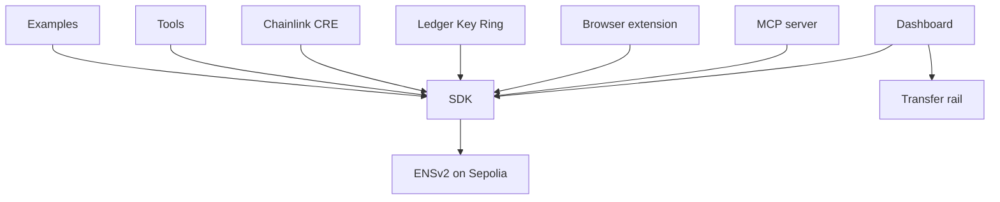

# Components

Rewall is one repository with one core library and several things built on top of it. Each folder is
its own component. It owns its own dependencies and has its own README. There is no root
`package.json` and no workspace.

Everything runs on the Sepolia test network. Sepolia is a copy of Ethereum used for testing, where
the money is not real. Real credentials do not belong in it.

## The folders

| Folder       | What it does                                                                                                                              | Page                                       |
| ------------ | ----------------------------------------------------------------------------------------------------------------------------------------- | ------------------------------------------ |
| `sdk/`       | The core library. It encrypts a secret, seals the key to ENS names, and reads and writes the ENS records. Everything else is built on it. | [SDK](/components/sdk)                     |
| `web/`       | The dashboard at [rewall.me](https://rewall.me). Store, share, revoke, recover, hold 2FA accounts and send private payments.              | [Dashboard](/components/dashboard)         |
| `mcp/`       | An MCP server. It lets an AI agent use a secret without ever seeing it. Hosted at [mcp.rewall.me/mcp](https://mcp.rewall.me/mcp).         | [MCP server](/components/mcp)              |
| `extension/` | A browser extension that fills sign-in codes from 2FA secrets stored under your name.                                                     | [Browser extension](/components/extension) |
| `ledger/`    | Enrols a server into a Ledger Key Ring with no USB port, using Rewall to deliver the credential.                                          | [Ledger Key Ring](/components/ledger)      |
| `cre/`       | A Chainlink workflow that reads a Rewall secret inside a secure enclave.                                                                  | [Chainlink CRE](/components/cre)           |
| `tools/`     | Scripts that set up the test names on Sepolia and prove each feature against the real chain.                                              | [Tools](/components/tools)                 |
| `rail/`      | A local copy of the private payment service, for testing only. Not part of Rewall.                                                        | [Transfer rail](/components/rail)          |

Two more folders hold no component. `examples/` has short runnable programs, one per feature,
described under [Examples](/examples). `docs/` is this site.

## How they fit together

Every folder links the SDK as `@rewall/sdk` and imports its built `dist` folder. The SDK talks to
ENSv2 on Sepolia. It reads through the `UniversalResolverV2` contract and writes through each
account's own `PermissionedResolver`. No component sends a secret to a Rewall server, because there
is none. The dashboard has a few server routes that pay for a new user's setup, and they hold no
secret.



Two arrows need a note. The Chainlink workflow itself runs in a runtime with no libsodium, so it
reads the chain and opens the secret with its own copy of the crypto. Only its setup scripts use the
SDK. The rail links the SDK for the wire format in `transfer.ts` and nothing else, so the client and
the server cannot drift apart.

Because everything imports `dist`, the SDK is built first.

```bash
cd sdk && pnpm install && pnpm run build && pnpm test
```

Then pick a folder and read its page. Most folders need `tools/.env`, which holds the test wallet
phrase and is never committed. Copy `tools/.env.example` to start. The [Tools](/components/tools)
page explains it.

## The test names

Three names on Sepolia are used in every check, each held by its own wallet.

```text
rewall-test-1.eth   the owner
rewall-test-2.eth   someone the owner shares with
rewall-test-3.eth   the recovery holder
```

A fourth wallet holds no name at all. It stands in for a stranger. It proves that reading a secret
is a matter of holding a sealed copy, not of being on a list.

## Rules the code follows

These come from the repository README, and every folder keeps to them.

- Nothing is mocked. Every check runs against real Sepolia. There are no fake contracts, no stubbed
  RPC answers and no placeholder fixtures.
- Nothing is guessed. Contract addresses, function signatures and package versions are read from a
  primary source or from the chain itself.
- Plaintext secrets and private keys are never logged, printed or written to disk.
- All cryptography comes from libsodium and WebCrypto. There are no custom primitives.

A few conventions follow from the layout. Each folder has its own `.prettierrc` and its own `format`
and `format:check` scripts. Indentation is four spaces. Package versions are never written by hand,
they come from `pnpm add`. One folder is the exception to `pnpm`. The `cre/enclave-grantee/`
subfolder is managed with `bun`, because the Chainlink toolchain compiles with it.
