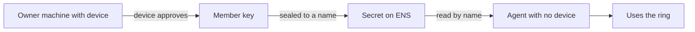

# Ledger Key Ring

A Ledger is a hardware wallet, a small device that holds keys and shows each request on its own
screen. Its Key Ring is a group of keys that can encrypt for every member of the group. A member is
only a keypair, so a server can be one.

The `ledger/` folder enrols a server into a Key Ring when that server has no USB port. It is
optional hardening. Nothing else in Rewall depends on it.

This runs on Sepolia, the Ethereum test network, and against Ledger's staging service. Real
credentials do not belong in it.

## The problem

The Key Ring has no answer for how a member reaches a machine you are not sitting at. Ledger's
`wallet-cli ring` has five verbs, `init`, `encrypt`, `decrypt`, `keys` and `destroy`. None of them
enrol anything. That gap is what this folder fills.

## The split

Ledger answers one question. Is this machine allowed in, and did a human agree? The device renders
the join on its own screen and someone presses the button. No software wallet can offer that.
Malware on the host can produce a signature, but it cannot press a button on a separate device.

Rewall answers the other question. Who is this machine, and how does the credential reach it? The
member is stored as a secret sealed to the agent's ENS name. It travels encrypted on a public chain,
addressed by a name rather than an IP address. It is revoked by rotating rather than by remembering
which boxes hold a copy.



## What happens

`src/enroll.ts` runs on the machine that has the device. It mints one member keypair for one agent.
It connects to the device and calls `authenticate` with a session. The device shows the join and a
person approves it. The result is a `trustchainId`, the identifier of the ring. The script then
disconnects the device and writes the member as a Rewall secret. The secret is
`ledger-ring.rewall.rewall-test-1.eth`, type `privkey`, granted to `rewall-test-2.eth`, with
`rewall-test-3.eth` as recovery.

`src/agent.ts` runs on a host with no device. It reads that secret with the agent's own Rewall
identity, rebuilds the member keypair in memory, and calls `authenticate` with the `trustchainId`
and no session. No device transport is registered at all. Then it encrypts and decrypts a message
with the ring's key to show the round trip works.

The device is optional exactly when the trustchain is already known. That comes from the type
Ledger's own kit exposes for the call.

```ts
{ keyPair; clientName; permissions } & ( { trustchainId; sessionId? } | { trustchainId?; sessionId } )
```

## The demo page

`demo.mjs` runs the whole story from a page with four buttons, so a person can press the approval on
screen.

```bash
pnpm run demo    # http://localhost:8080
```

The device screen is embedded from Speculos, the emulator, so you watch the request arrive and
press the buttons yourself. The four buttons turn on the Ledger, let a server ask to join, unplug
the Ledger, and run the server with no device anywhere. Each one runs the same scripts as the
commands below and streams their output to the page. Nothing on the page is new behaviour.

## Commands

Needs Docker running and `REWALL_TEST_MNEMONIC` in `tools/.env`.

```bash
cd sdk && pnpm run build
cd ../ledger && pnpm install

pnpm run speculos       # clones app-ledger-sync, builds it, starts the emulator
pnpm run enroll         # owner, device approves, member sealed to the agent's name on chain
pnpm run speculos:stop  # there is now no device anywhere
pnpm run agent          # agent reads the member off chain and uses the ring
```

`pnpm run speculos` clones the app, builds it in Ledger's image, boots Speculos and waits until the
screen reads ready. Each step is skipped when its output already exists, so the first run takes a
couple of minutes and later ones take seconds.

Open `http://localhost:5000` while it runs to see the device. By default `enroll` presses the
buttons for you. To approve by hand, which is the honest version:

```bash
LEDGER_MANUAL=1 pnpm run enroll
```

Right scrolls, both buttons approve. The two screens are `Connect to Ledger Sync?`, answered with
**Connect**, and `Turn on sync for Ledger Wallet?`, answered with **Turn On sync**. The names and
label can be changed with `LEDGER_OWNER_NAME`, `LEDGER_AGENT_NAME`, `LEDGER_RECOVERY_NAME` and
`LEDGER_SECRET_LABEL`.

## No hardware

The device is emulated with Speculos running `app-ledger-sync`, the real Key Ring app, compiled from
source with Ledger's own `ledger-app-builder` image. Nothing is stubbed. The device commands, the
secp256k1 signing and the trustchain blocks are real. Only the silicon is emulated. That is the same
bargain the whole project makes by running on Sepolia rather than mainnet.

Two consequences, stated rather than hidden:

- It runs against Ledger's staging trustchain. Production refuses a self-compiled app with
  `401 Attestation is for an unknown application`, because the attestation is not Ledger signed. On
  real hardware with the store build, the same code points at production.
- Speculos is a development tool. Ledger's own guidance is that it must not back a production ring,
  and this repo agrees.

## What it does not fix

The member private key does travel to the agent. It has to. Ledger's TypeScript kit has no call
that adds someone else's public key to a trustchain. So the keypair must exist on the machine
holding the device at the moment of approval.

What changes is which credential moves and how. It is one member minted for one agent, not the
owner's own ring membership, so removing it cuts off that agent alone. It moves sealed to the
agent's published key rather than copied over SSH. And it is revoked by name, on chain, rather than
by remembering where it was put.

A compromised agent still loses the ring access it holds. Hardware does not fix host compromise. It
fixes onboarding, which is where the ceremony was missing.

## Rough edges

Two of them shaped the design above. Only `OWNER` permissions enrol, since scoped permissions fail
after the first device approval with `Security issue with bad state`. And there is no call that
adds another member's public key. Both are written up with versions, reproductions and suggested
fixes in `ledger/DX.md` in the repo.
