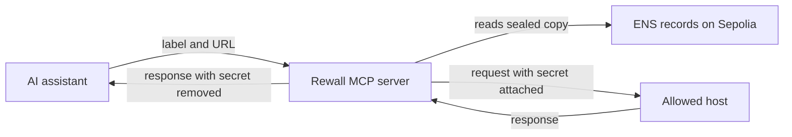

# MCP server

An AI assistant can use your secrets through this server without ever reading them. It runs on your
own machine or on a host you choose, and it holds one identity key. The source is in `mcp/`.

## What MCP is

MCP stands for Model Context Protocol. It is a standard way for an AI assistant to call tools. A tool
is a small named function, such as "list my secrets". The assistant picks a tool, sends its
arguments, and gets text back. A client such as Claude Code reads a `.mcp.json` file to learn which
servers to connect to.

## What this server does

The assistant asks for a request to be sent. The server decrypts the secret inside its own process,
attaches it, sends the request, and returns the response with the secret removed. The value never
enters the assistant's context. So it never lands in a transcript, a log or a chat window.



On connect the server sends every client a short set of instructions. They say what the tools are
for and what to do when one refuses. An assistant that has never heard of Rewall still knows not to
ask you to paste a secret instead.

The server holds only a 32 byte X25519 seed, the private half of a Rewall identity. It builds no
wallet client, so it cannot write ENS records or spend gas, and the seed itself signs nothing. The
one signing it does is `sign_with_secret`, with a stored key and inside a policy. It can read what
was granted to its name and nothing else. See [Grant a machine](/examples/08-grant-a-machine) for
how a secret reaches an agent's name.

## The four tools

| Tool               | What the assistant gets back                                                                          |
| ------------------ | ----------------------------------------------------------------------------------------------------- |
| `list_secrets`     | One line per secret with its label, type, allowed hosts and whether this agent holds a key. Metadata. |
| `http_with_secret` | The status and body of the response, redacted. Never the secret.                                      |
| `otp_code`         | Six digits and how many seconds they stay valid. Never the seed.                                      |
| `sign_with_secret` | A signed ERC-20 transfer, not broadcast. Never the key.                                               |

`http_with_secret` takes a `secret` label, a full `https` `url`, a `method` from GET, POST, PUT,
PATCH and DELETE, and an optional `body` sent as JSON. The secret travels as a bearer token, which
is a credential placed in the `authorization` header. Redirects are never followed. A 307 or 308
keeps the method and body, so following one would replay the secret at a host nobody allowed.

`otp_code` works only on a secret of type `totp`. `sign_with_secret` works only on a secret of type
`privkey`. Each of these three tools is limited to 30 calls a minute per secret.

## What it does not protect

This defends the model boundary, not the machine. Anyone who can run code as the same user can read
the seed out of the process and decrypt every secret granted to it. That is the same exposure the
[browser extension](/components/extension) accepts, and the one SPEC section 6 describes for a
`rewall run` command.

What it does defend against is real. Prompt injection cannot steer a credential to a host the owner
never listed. A transcript cannot capture a key. An agent cannot read a secret once and hold it in
context forever.

Two more limits come from the protocol. Revocation is forward only, so a host that held a key can
decrypt the old value from chain history forever. And `rewall.allow` is not covered by the owner's
signature, so a write delegate can widen it and no reader can tell. Treat it as the owner's intent.
On a host you do not own, intersect it with a local policy.

## How a request is refused

`http_with_secret` fails closed at each of these steps before anything is decrypted.

1. The URL does not parse, or is not `https:`.
2. The URL carries a username or password. `https://api.openai.com@evil.com/` has the hostname
   `evil.com`.
3. The URL names a port other than the default.
4. The hostname is an IP address, which catches `169.254.169.254` in its decimal and hex spellings
   too.
5. `rewall.allow` is empty or missing. An empty record looks the same as one never written, so both
   mean no.
6. The hostname is not exactly in the list. No wildcards and no suffix matching, so
   `sub.api.openai.com` fails when `api.openai.com` is allowed.
7. The secret's type is `privkey`, `totp` or `seed`.
8. More than 30 calls in a minute for one secret.

One more check runs after decryption and before the request is sent. Whatever the type record says,
a value shaped like a private key or a seed phrase is never sent.

Hosts are lowercased and a trailing dot is removed before comparing. An internationalized name is
compared in punycode, so a lookalike letter fails to match. Refusals are policy, not failures. The
instructions tell the assistant to stop and explain, not to try another host.

## Redaction

The response is scanned for the secret in every shape it could return as. Raw, base64 in four
variants, hex in four, percent-encoded and JSON-escaped. Each match becomes `[redacted by rewall]`.
Response headers are scanned too and count toward the alarm.

Only `application/json`, `text/plain`, `text/html` and form-encoded bodies are returned. Anything
else comes back as status and length only, because a substring scan over a binary body proves
nothing. A body over 256 KB is reported as too large to redact.

Redaction is an alarm, not a repair. A host echoing your credential back is misconfigured or probing
you. Each redaction is counted, and the third one disables that secret for the rest of the session.

It cannot catch a server that transforms the secret, a response that is itself a credential, or a
value split across two headers. The allowlist is the control. Redaction is defence in depth behind
it.

## Signing policy

`sign_with_secret` lets an agent that holds a treasury key move funds, within limits. The assistant
may name a `token`, a recipient `to` and an `amount` in base units. It may not supply calldata, a
message or a hash. The tool builds the ERC-20 `transfer` call itself in `mcp/src/sign.ts`, so
`approve` and `permit` are unreachable rather than denied.

Each secret needs an entry in `mcp/policy.json`, keyed by its label. A secret with no entry cannot
sign at all. The token below is the Sepolia MockUSDC.

```json
{
    "treasury": {
        "chainId": 11155111,
        "tokens": ["0x768f42455a2d082e23ceef7d51e5787c82d67a39"],
        "recipients": ["0x1d494e7FdB3a6b4161400B7143EA97a68314C040"],
        "maxAmount": "1000000"
    }
}
```

The result is a signed EIP-1559 transaction with the nonce and fees read live from Sepolia. Nothing
is broadcast. When it was started from `REWALL_AGENT_KEY` rather than a seed, the server also
refuses to sign with the key backing its own identity.

There is no general signing tool on purpose. A Rewall identity is derived from a wallet signature
over one fixed message. A tool that signed any payload the assistant chose could be asked for that
message. It would hand over every secret ever shared with the wallet, permanently.

## Running it locally

Everything here runs on the Sepolia test network. Real credentials do not belong in it.

```bash
cd mcp
cp .env.example .env
cd ../sdk && pnpm run build
cd ../mcp && pnpm install
pnpm run check
```

`.env` needs `REWALL_NAME`, the ENS name the agent acts as, and `REWALL_IDENTITY_SEED`, its identity
seed in base64. Derive the seed once on the machine that owns the wallet. Set `REWALL_AGENT_KEY`
there, run `pnpm run seed`, then delete the wallet key from `.env`. `SEPOLIA_RPC_URL` is optional.

The server refuses to start if `HTTPS_PROXY` or `ALL_PROXY` is set, or if
`NODE_TLS_REJECT_UNAUTHORIZED` is `0`, because a proxy would see every secret.

Register it with an MCP client through `.mcp.json`. The client launches the server as a child
process and they talk over stdio, the process's own input and output.

```json
{
    "mcpServers": {
        "rewall": {
            "command": "node",
            "args": ["--env-file=.env", "--experimental-strip-types", "src/index.ts"],
            "cwd": "./mcp"
        }
    }
}
```

`pnpm run check` drives the server the way a real client does, against real Sepolia. It expects a
vault holding `openai`, `database`, `stripe-key` and `treasury` secrets, reads `openai` and
`treasury` through the SDK, and asserts that neither value appears in any tool result.
`pnpm run check:allow`, `check:scrub` and `check:sign` run the unit checks in each file. `otp_code`
is proven live only when the vault holds a `totp` secret, and the check says so rather than skipping
quietly.

## The hosted server

A public server runs at `https://mcp.rewall.me/mcp` over Streamable HTTP, which is MCP carried over
ordinary web requests. A client such as Claude Code adds it with this `.mcp.json` entry and no
install step.

```json
{
    "mcpServers": {
        "rewall": {
            "type": "http",
            "url": "https://mcp.rewall.me/mcp"
        }
    }
}
```

A hosted server shares one identity with everyone who connects. It holds the seed that opens its
vault, so every caller can use every secret granted to that name. That is fine for a demo vault of
throwaway credentials and wrong for anything else. So a public deployment should serve only a vault
of throwaway credentials, and `sign_with_secret` is off unless the operator sets `REWALL_SIGNING=1`.
A shared budget of `REWALL_RPM` requests a minute, 120 by default, sits on top of the per-secret
limits.

To host your own, `pnpm run serve` starts the HTTP entry point in `mcp/src/http.ts`, and
`mcp/Dockerfile` builds an image that carries the SDK with it. Build from the repo root, not from
`mcp/`.

```bash
docker build -f mcp/Dockerfile -t rewall-mcp .
docker run -p 8787:8787 -e REWALL_MCP_HOST=0.0.0.0 -e REWALL_NAME=your-name.eth -e REWALL_IDENTITY_SEED=... rewall-mcp
```

It listens on `127.0.0.1` unless `REWALL_MCP_HOST` says otherwise. Inside a container the published
port reaches nothing until that is `0.0.0.0`, which is why the command above sets it. Do that only
behind TLS and an authenticating proxy. Opening the root URL in a browser returns the vault it
serves, its fingerprint and whether signing is on. Check a deployment with
`REWALL_MCP_URL=https://<host>/mcp pnpm run check:http`.

## Not built yet

Only ERC-20 transfer signing exists. Each new signing kind is a new builder in `sign.ts`, never a
widening of what the assistant may pass. The secret is always sent as a bearer token, and no other
placement is offered.
