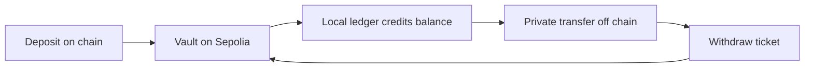

# Transfer rail

The `rail/` folder is a local stand-in for Chainlink's Compliant Private Transfer service, the
payment service that section 9 of `SPEC.md` in the repo builds on. It is a test harness. It is not
part of Rewall, and it must never become one.

It speaks the same wire format and the same vault semantics as Chainlink's service. A client drives
either one by changing two environment variables.

This runs on Sepolia, the Ethereum test network. Real money and real credentials do not belong in
it.

## Why this exists

Chainlink's deployed service at `convergence2026-token-api.cldev.cloud` authenticates requests but
no longer credits deposits. This was verified across two finalised deposits, with the vault holding
the tokens on chain and every policy check passing. The indexer that turns a `Deposit` event into a
spendable balance is not running, and only Chainlink can restart it.

Rather than stub the rail, this folder runs the missing half. Everything the client sees is real.

## Not part of Rewall

The server holds every balance in plaintext, and it holds the key that mints withdraw tickets. SPEC
section 10 rules out a Rewall operated server, and this is exactly one.

Rewall also has to stay portable back to Chainlink's service if it returns. So Rewall may use only
the five endpoints Chainlink documents, `/balances`, `/transactions`, `/shielded-address`,
`/private-transfer` and `/withdraw`. It may depend on nothing else this server does. Anything Rewall
wants to add goes in a receipt secret, never in the rail.

## What Rewall builds on it

Three things from SPEC section 9. A name publishes a shielded address as `rewall.shielded`, so
anyone can pay a name privately. After a payment the sender writes a receipt secret of type
`receipt` and grants it to whoever should see it. And a shared treasury is a signing key stored as a
secret and granted to specific names. See [Pay a name](/examples/06-pay-a-name) and
[Share a treasury](/examples/07-share-a-treasury).

## What is real and what is local



Real, on Sepolia:

- The vault, the token and the ACE policy engine are deployed contracts. ACE is Chainlink's policy
  engine, the contract that says whether a deposit, transfer or withdrawal is allowed. The vault
  asks it before it moves anything.
- `checkPrivateTransferAllowed` and `checkWithdrawAllowed` are `eth_call`s into Chainlink ACE.
- Deposits and withdrawals move real ERC-20 balances.
- Withdraw tickets are EIP-712 signatures the vault verifies by recovering the signer.

Local, in this process:

- The balance ledger, the shielded address mapping and the transfer history, all in a SQLite file
  called `rail.db`.

Private transfers never touch the chain, which is the point. Deposits and withdrawals do, and are
public with their amounts. So the vault's entry and exit are visible even though the transfers
between are not.

## Requirements

- Node 22 or newer, for `node:sqlite` and type stripping.
- Foundry, to build and deploy the contracts.
- A wallet with Sepolia ETH. About 0.02 covers a deploy.

## Setup

Run these from the `rail/` folder.

```bash
forge install --no-git \
    foundry-rs/forge-std \
    OpenZeppelin/openzeppelin-contracts \
    OpenZeppelin/openzeppelin-contracts-upgradeable \
    smartcontractkit/chainlink-ace
pnpm install
cp .env.example .env
```

Put your mnemonic in `.env`, then deploy. It prints the vault and the policy engine to copy back in,
alongside the token it registered, Circle's Sepolia USDC unless `TOKEN_ADDRESS` names another.

```bash
pnpm run deploy
```

Set `DEPLOYER_INDEX` to a wallet nothing else is using. A deploy is seven transactions in a row. Any
other process sending from the same account takes a nonce out from under it, and the run fails part
way.

## Running

The server watches the chain and serves the API. Leave it running.

```bash
pnpm run serve
```

Then put tokens in and use them. The deployer needs a USDC balance first, since nothing here mints
it.

```bash
pnpm run deposit
pnpm run redeem <ticket>
```

`pnpm run verify` checks the privacy claims against the chain rather than taking them on trust. It
checks that a private transfer moves no tokens through the vault, that a shielded address is
unlinkable, and that one account cannot read another's ledger.

`CONFIRMATIONS` defaults to 1 so the loop stays fast. Raise it to reproduce the roughly thirteen
minute finality delay the real service has.

## Pointing the SDK at it

The SDK's `Transfers` client targets Chainlink's deployment by default. Pass `api` and `vault` to
target this one instead.

```ts
import { Transfers } from "@rewall/sdk";

const transfers = new Transfers({
    account,
    api: "http://127.0.0.1:8788",
    vault: process.env.VAULT_ADDRESS,
});
```

The examples read `RAIL_API`, `VAULT_ADDRESS` and `TOKEN_ADDRESS` from `examples/.env`.
`VAULT_ADDRESS` and `TOKEN_ADDRESS` are what `pnpm run deploy` prints. `RAIL_API` is where the
server listens, `http://127.0.0.1:8788` by default.

## Pointing the dashboard at it

A browser cannot call this server directly. It sends no CORS headers and answers anything that is
not a POST with a 404. So the dashboard posts to its own `/api/rail/<endpoint>` route, which
forwards the already signed body here and relays the answer back untouched. That proxy holds no key,
signs nothing, decrypts nothing and reads no field. It refuses any path outside the five. The
signature this server checks is still the only thing that authorises a spend.

The dashboard needs two values in `web/.env.local`. `NEXT_PUBLIC_REWALL_VAULT` is the vault address
`pnpm run deploy` prints. `REWALL_RAIL_URL` is where the server listens, `http://127.0.0.1:8788` by
default. The token address is fixed in `web/src/lib/rail.ts` rather than configured.

The token is Circle's Sepolia USDC, which nothing here can mint. The dashboard's faucet hands a new
wallet one USDC out of the sponsor's own balance. So send that sponsor wallet USDC from Circle's
faucet before anybody tries to deposit. A redeploy does not change this, since the token is not
redeployed with it.

If every call comes back `request authentication failed`, the vault address is from a previous
deploy. The vault is the EIP-712 `verifyingContract`, so a stale one recovers to a different signer.

## Caveats

The vault's ticket signer is set at deployment and cannot change. Changing `TICKET_SIGNER_INDEX`
means deploying a new vault, and tokens left in the old one cannot be withdrawn. Delete `rail.db`
when you redeploy, or the ledger will describe a vault that no longer holds the tokens.

Balances are held in one process with no authentication beyond the request signature. Anyone who
can reach the port can spend what they can sign for, and anyone who can read `rail.db` sees every
balance. `RAIL_HOST` defaults to `127.0.0.1`. If the dashboard and this server share a host, leave
it there. If they do not, bind the private interface they share and firewall the port to the web
host's address. Never set it to `0.0.0.0`, which puts every balance behind nothing but a signature
check. There is no TLS and none is planned. If the hop crosses anything public, put it in a tunnel
or behind a reverse proxy that ends TLS. Treat it as what it is, a development fixture.
