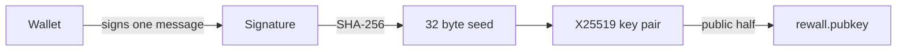

# SDK

`@rewall/sdk` is the core library in `sdk/`. Every other part of Rewall is built on it. It does
three things. It turns a wallet signature into an encryption key. It encrypts a secret and seals that
key to each reader's ENS name. It reads and writes the ENS records that hold all of this.

It runs against ENSv2 on the Sepolia test network. Real credentials do not belong in it.

## The key

A name's private key is never stored. It is derived from one wallet signature each time it is
needed.

1. The wallet signs a fixed EIP-712 message, `IDENTITY_TYPED_DATA`. EIP-712 is a signing format
   that lets the wallet show the fields being signed instead of an opaque line.
2. The 65 byte signature is reduced to 64 bytes. The recovery byte is dropped and `s` is folded to
   the low half of the curve order, so wallets that differ on either still give one key.
3. Those 64 bytes are hashed with SHA-256. The result is a 32 byte seed.
4. The seed is the X25519 secret key. The public key is `crypto_scalarmult_base(seed)` from
   libsodium.



The message never changes, because changing one byte would change every identity.

```text
domain    name "Rewall", version "1"
type      Identity(string purpose, string warning)
purpose   Derive the X25519 key that unseals secrets shared with this wallet
warning   Sign this only in Rewall, whoever collects it reads every secret shared with you forever
```

The public half is published on your name as `rewall.pubkey`. A fingerprint is the first 8 bytes of
`keccak256(pubkey)` as 16 lowercase hex characters, and it names your sealed copy of a secret as
`rewall.key.<fingerprint>`.

Two things follow. The signature is the key, so anyone who obtains it reads every secret ever
shared with you, forever. And a wallet that does not sign the same way twice cannot be used.
MetaMask is the supported wallet.

## A secret on chain

A secret is a set of ENS text records on `<secret>.rewall.<name>.eth`. The value is encrypted with
AES-256-GCM under a random key. That key is sealed once per reader with a libsodium sealed box. Each
sealed copy is its own record, `rewall.key.<fingerprint>`. The names of everyone with access are
written too, signed by the owner, because a rotation has to know who to re-seal for.

Sharing adds one sealed copy. Revoking encrypts again with a new key and re-seals for everyone who
stays. The old copies then open nothing. [How it works](/how-it-works#seal) draws this out.

## Building a client

```ts
import { Rewall } from "@rewall/sdk";

const rewall = new Rewall({
    publicClient, // viem, reads
    walletClient, // viem, optional, writes and signatures
    account, // the wallet, optional with walletClient
    name: "alice.eth", // which of the caller's names it acts as
    universalResolver: "0x4a1817d13e9cf196f471725176355c1234b63c70",
    identity, // optional, a key derived elsewhere
});
```

`name` is a namespace choice, not an identity. It says where `publishIdentity` writes, which
namespace `list` reads, and what goes into `rewall.owner`. One wallet can hold several names, and
the key is the same for all of them.

## Methods

Every method is on the `Rewall` class.

| Method                                      | What it does                                                                                                  |
| ------------------------------------------- | ------------------------------------------------------------------------------------------------------------- |
| `identity()`                                | Derives the key. Cached in memory for the process, never written to disk.                                     |
| `publishIdentity()`                         | Writes `rewall.pubkey` on `name`. Returns `null` if it is already there.                                      |
| `create(secretName, plaintext, options)`    | Encrypts, seals to every reader, signs the reader lists, and writes it all in one transaction.                |
| `get(secretName)`                           | Reads and decrypts. Returns a `Uint8Array` that stays in memory.                                              |
| `grant(secretName, granteeName, options?)`  | Seals the data key to one more name. Pass `{ subtree: true }` for a whole subtree.                            |
| `revoke(secretName, granteeName, options?)` | Rotates without that name. Pass `{ subtree: true }` or `{ recovery: true }` to say which kind of access goes. |
| `rotate(secretName, plaintext?)`            | New data key, new blob, new sealed copies for everyone who stays. Optionally a new value.                     |
| `reauthorize(secretName, lists?, options?)` | Re-signs the reader lists. Owner only.                                                                        |
| `setSite(secretName, site?)`                | Fixes `rewall.site` on a 2FA secret without rotating.                                                         |
| `list(namespaceName?)`                      | Reads `rewall.index` under `rewall.<name>` and returns the labels.                                            |
| `unindex(secretName)`                       | Removes a label from that index.                                                                              |
| `publicKeyOf(name)`                         | Reads a name's `rewall.pubkey` and returns the key with its fingerprint.                                      |
| `subtreeKeyOf(name)`                        | The same for `rewall.subtree.pubkey`.                                                                         |
| `resolveRecovery(entry)`                    | Turns a recovery entry, a name or `guardians:<owner>`, into a key.                                            |
| `heldKeys()`                                | Every key this caller can decrypt with, its own plus any subtree key sealed to it.                            |
| `ownerAddressOf(secretName)`                | The address that holds the name in its registry.                                                              |
| `publishShielded(address)`                  | Writes `rewall.shielded` on `name`, so others can pay it privately.                                           |
| `shieldedOf(name)`                          | Reads another name's `rewall.shielded`.                                                                       |

`create` requires at least one entry in `recovery`. It refuses to replace a live secret unless
`overwrite: true` is passed. The other options are `type`, `grantees`, `subtreeGrantees`, `allow`
and `site`.

## Examples

Store a secret and read it back.

```ts
await rewall.publishIdentity();

await rewall.create("openai.rewall.alice.eth", new TextEncoder().encode("the api key"), {
    type: "apikey",
    grantees: ["bob.eth"],
    recovery: ["vault.alice.eth"],
    allow: ["api.openai.com"],
});

const value = await rewall.get("openai.rewall.alice.eth");
```

Share, take back, rotate and list.

```ts
await rewall.grant("openai.rewall.alice.eth", "carol.eth");
await rewall.grant("openai.rewall.alice.eth", "team.eth", { subtree: true });

await rewall.revoke("openai.rewall.alice.eth", "bob.eth");
await rewall.revoke("openai.rewall.alice.eth", "team.eth", { subtree: true });

await rewall.rotate("openai.rewall.alice.eth", new TextEncoder().encode("a new value"));

const labels = await rewall.list();
```

## Subtree helpers

`rewall.subtree` shares one key with every subname under a name. The parent derives the key,
publishes the public half as `rewall.subtree.pubkey`, and seals the private half to each member as
`rewall.subtree.key`.

```ts
await rewall.subtree.init(); // publishes the subtree key on name
await rewall.subtree.distribute(["ci.alice.eth"]); // seals it to each member
await rewall.subtree.rotate(); // bumps the version, locking every member out
await rewall.subtree.version();
```

Removing one member means rotating, distributing to the others again, and granting each affected
secret to the new key.

## Guardian helpers

`rewall.guardians` splits a recovery key across several names. Each share is sealed to one guardian
and stored on the owner's name as `rewall.guardian.<fingerprint>`. A threshold of guardians can
rebuild the key for a new wallet.

```ts
const recovery = await rewall.guardians.init(["a.eth", "b.eth", "c.eth"], 2);
rewall.guardians.entry(); // "guardians:alice.eth", passed to create as a recovery entry
await rewall.guardians.of("alice.eth"); // names and threshold

await guardian.guardians.approve("alice.eth", newPublicKey); // a guardian publishes on its own name
const shares = await replacement.guardians.collect("alice.eth"); // the new wallet gathers them
const key = await replacement.guardians.recover(shares, "alice.eth");
```

`reshare` returns the re-sealed share as a string instead of publishing it, for a guardian whose
records are written by a parent name.

## The 2fa subpath

`@rewall/sdk/2fa` is a separate import that reads authenticator setup keys and computes codes. It
does not pull in viem or libsodium, so a browser background script can use it on its own. It exports
`parseOtp`, `describeOtpUri`, `otpSnapshot`, `completeOtpKey` and `normalizeSite`.

## A read only client

A client built with an `identity` and no `walletClient` can read but not write. Any write throws
`ReadOnlyError`. That is how the MCP server and the extension run. They hold only the 32 byte seed,
rebuilt with `identityFromSeed`, and never a wallet key.

```ts
import { Rewall, identityFromSeed } from "@rewall/sdk";

const identity = await identityFromSeed(seed);
const rewall = new Rewall({ publicClient, name, universalResolver, identity });
```

A host holding that seed can decrypt what was granted to the name and nothing else. It cannot sign,
spend gas or rewrite records.

## Building and testing

```bash
cd sdk
pnpm install
pnpm run build     # writes dist/, which every other folder imports
pnpm test          # unit tests, no network
```

The tests prove things the docs cannot. They recover a signer from `N - s` to show the curve order
is right. They show that `crypto_box_seed_keypair` gives a different key from the same seed, which is
why the SDK never uses it. They show that moving a blob to another name makes it refuse to open.

## What it never does

It never writes a secret to disk. It never logs one. It never uses a crypto primitive that is not
libsodium or WebCrypto. And it never reads anything from a Rewall server, because there is none.
