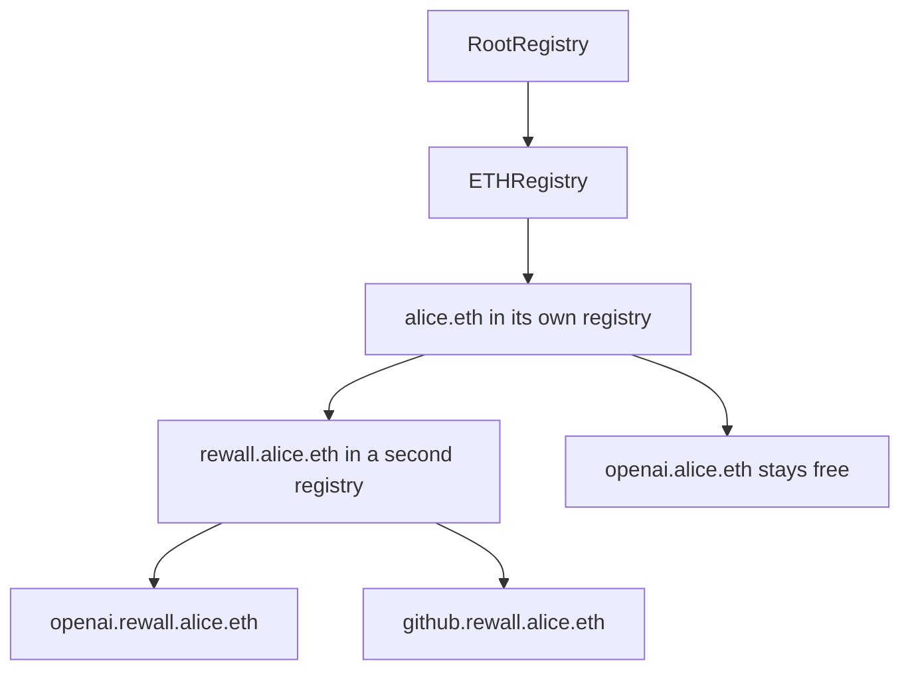

# Built on ENSv2

Rewall has no database, no user table and no server. ENS is all three. A name holds the public key,
the encrypted secret, the sealed copies and the list of who may read. This page explains what ENS
is, what ENSv2 adds, and exactly how Rewall uses it. Everything here runs on the Sepolia test
network, and real credentials do not belong in it.

## What ENS is

ENS is the Ethereum Name Service. It turns a readable name like `alice.eth` into things a computer
needs, such as an address or a public key. A name is owned by a wallet. Anyone can read a name's
records, and only the owner, or someone the owner allows, can write them.

A text record is a small named string stored on a name. `rewall.pubkey` on `alice.eth` is one. Every
piece of Rewall state is a text record, listed under [the records](/how-it-works#the-records) on the
how it works page.

## Why a name and not an account

An address is 20 bytes nobody can remember and carries no records. A name is readable and can hold
any record its owner writes. That difference does all the work.

- Sharing becomes naming. To share with Bob, seal the data key to the key at `bob.eth`. Nobody signs
  up and nobody runs a directory.
- Ownership is a fact the chain enforces. The address holding a name is what a rotation checks the
  owner's signature against, and it is the one thing a write delegate cannot rewrite.
- Names have subnames, so a secret is a subname and a team is a subtree. Access can be given to
  everything under `team.eth` at once.
- A name outlives a key. After recovery the owner publishes a new `rewall.pubkey` and keeps the same
  name, so nobody who shares with them has to learn anything new.

## What ENSv2 changes

ENSv2 splits the name system into small contracts and hands each one to its owner. These are the
pieces Rewall touches.

**Registries are a hierarchy.** `RootRegistry` holds the top. `ETHRegistry` holds every `.eth` name.
Each name can point at a registry of its own with `setSubregistry`, and that registry holds the
name's subnames. A name inside a registry is a token, and its id can change, so Rewall addresses
names by labelhash, the keccak256 hash of one label.

**Registries are permissioned.** Every action on a name is a role. Rewall deploys each registry it
needs from `UserRegistryImpl` through `VerifiableFactory` and starts it with
`initialize(rootAccount, roleBitmap)`. Registering a subname is one call,
`register(label, owner, subregistry, resolver, roleBitmap, expiry)`, where expiry is an absolute
unix timestamp.

**`PermissionedResolver` holds records with per name access control.** `setText(node, key, value)`
writes one record and `text(node, key)` reads it, where the node is the namehash of the full name.
`multicall(bytes[])` runs many writes in one transaction. `authorizeNameRoles` hands a role on one
name to another account, and `authorizeTextRoles` does it for one key on one name. ENS calls this
Enhanced Access Control. `pnpm run delegate` in `tools/` proves the per key form against Sepolia.

**Roles are bitmaps.** A role is one bit in a 256 bit number. The admin variant of a role is the
same bit shifted left by 128. Rewall uses `bigint` for them. When a secret subname is given an entry
of its own, it gets `SET_RESOLVER` and its admin variant and nothing else, because a secret needs no
children.

**`VerifiableFactory` deploys proxies.** A resolver is a UUPS proxy over one shared implementation,
deployed with `deployProxy(implementation, salt, initData)`, and registries come from the same
factory. One salt is one proxy forever, so `tools/deploy.ts` records every address in
`deployments.json` and checks for code there before it deploys anything again.

**`UniversalResolverV2` finds everything.** `findResolver(name)` returns the resolver a name points
at, `resolve(name, data)` runs a read through it, and `findParentRegistry(name)` returns the
registry that holds a name. All three take a DNS encoded name, the wire form where each label is
prefixed with its length.



## A secret is a subname

`tools/deploy.ts` builds the tree once per owner. It deploys a registry for `alice.eth` and points
the name at it with `setSubregistry` on `ETHRegistry`. It deploys a second registry for the `rewall`
label and registers `rewall.alice.eth` in the first one, pointing at the second, with the owner's
resolver and the same expiry as `alice.eth`. That label reserves the subtree, so `openai.alice.eth`
stays free for whatever alice wants.

From then on a secret needs no registry call at all. Its records are written to the namespace's
resolver under the namehash of the full secret name. `UniversalResolverV2` resolves an unregistered
subname through the nearest registered name above it, so `openai.rewall.alice.eth` reads back
exactly as if it had an entry of its own. Ownership anchors the same way. Before a
rotation, the reader list check walks up to the nearest registered name, `rewall.alice.eth`, and
compares the signer to its owner. Storing a secret is therefore one transaction. `ensureSecretName`
in `sdk/src/client.ts` can still give a secret its own entry with `register`, which only a transfer
of that one secret to a different owner would need.

## One resolver per account

`tools/deploy.ts` deploys exactly one `PermissionedResolver` per participant and sets it on the
`.eth` name. Every subname that account creates points at that same contract. There is never a
resolver per secret.

This works because records inside a resolver are keyed by `namehash(fullName)`. The records of
`openai.rewall.alice.eth` and `github.rewall.alice.eth` sit in one contract under two different
nodes and never touch. The resolver is initialized with `initialize(admin, roleBitmap, setters)`,
with the owner as admin and every role set.

The SDK never hardcodes or caches a resolver address. Every write looks it up again with
`findResolver`, because an owner can repoint a name at a different resolver at any moment.

## Reading records

Every read goes through `UniversalResolverV2.resolve`. The SDK encodes a `text(node, key)` call,
wraps it in `resolve(dnsEncodedName, data)`, and decodes the string that comes back. That exercises
the whole lookup path, registry to resolver to record, the same way any ENS client would.

`readTexts` in `sdk/src/records.ts` issues one `resolve` per key and sends them in parallel. ENSv2
also supports batching them as `resolve(dnsEncodedName, multicall(bytes[]))`, which the SDK does not
use yet.

## Writing records

Every write is one `PermissionedResolver.multicall(bytes[])` holding a list of `setText` calls. A
secret's blob, its sealed copies, its lists and its signature land in one transaction. Records for
several names share that transaction when they share a resolver, which by design they do. Creating a
secret writes the secret's records and updates `rewall.index` on `rewall.alice.eth` in the same call.
`pnpm run verify` in `tools/` writes two records this way and reads one back through the universal
resolver.

## Registering a name on Sepolia

A `.eth` name comes from `ETHRegistrar` in two steps, a commit and then a reveal.
`tools/bootstrap.ts` does this for the three test names.

1. Compute a commitment with `makeCommitment`, which takes seven fields including a random secret.
2. Send `commit(commitment)`.
3. Wait `MIN_COMMITMENT_AGE`, which is 60 seconds. A commitment stays valid for 86400 seconds.
4. Send `register`, which takes the same seven fields plus `paymentToken`. Every field must match
   the commitment or it reverts without saying which one differed.

Payment is in `MockUSDC`, a test token whose `mint` has no access control. The script mints the
price and calls `approve` on the registrar first, since a fresh address has zero allowance. A label
of 5 or more characters costs 8.000021 USDC a year, 4 characters 160.000009, 3 characters
640.000005, and 1 or 2 characters revert. The token is worth nothing, so a name costs only gas.
The shortest registration is 28 days, which is also the grace period. The test names are registered
for one year and expire on 2027-09-10.

## Why not ENSv1, and why raw viem

SPEC section 10 targets the ENSv2 registry and permissioned resolver contracts, not ENSv1. Rewall
depends on three things those contracts give it. Write access on one name or one key inside a
shared resolver. A registry the owner runs, so secrets can be minted as subnames without asking
anyone. A resolver deployed once per account from a factory that can verify it with
`verifyContract(address)`, which reverts on failure.

All contract calls use viem 2.56.3 with `parseAbi` strings. `@ensdomains/ensjs` is never installed.
Its `registerName` uses a hardcoded ETH registry that is not the one the canonical root points at,
so names register into a tree nothing resolves against. Signatures were read from the
ENS contracts source at commit `97a57293f3b4279d94b571e678edb53ce62638f4`, the one that produced
the live deployment, and confirmed against deployed bytecode.

## Addresses on Sepolia

Verified against the ENS deployments page and confirmed to hold live bytecode. `tools/participants.ts`
and `tools/deploy.ts` hold the ones the scripts need. The SDK hardcodes none and takes
`universalResolver` as a constructor argument.

```
RootRegistry                     0x8115186e8f2e0b0281e86ab91f0f48ba90364354
ETHRegistry                      0xbdc85dd5b15d7ecb354cd7cb6f2c50b4f2c4f0e2
ETHRegistrar                     0xa88553f454b77203b0d036a05c894d555eaaa2cc
UserRegistryImpl                 0x624a25d67b59d587752ebec8dded8827dae52050
UniversalResolverV2              0x4a1817d13e9cf196f471725176355c1234b63c70
PermissionedResolverImpl         0x9eae5c2730a7dd16bdd1dee6421a1b91e3b0365e
PublicResolverV2                 0xe7b9a25607e02da8145e4eb1836ca539e53f11f7
VerifiableFactory                0x10dc6333cdfe1fcef624c6e0a8221b91804cd7ef
MockUSDC                         0x768f42455a2d082e23ceef7d51e5787c82d67a39   6dp, open mint
MockDAI                          0x5472c5725a00b7ba11f0794a79d08ade6f4683bd   18dp
StandardRentPriceOracle          0x8914b66260eb8c4fff795650c3ae8cd335958987
UpgradableUniversalResolverProxy 0xeEeEEEeE14D718C2B47D9923Deab1335E144EeEe   viem default
```

The RPC is `https://ethereum-sepolia-rpc.publicnode.com`, the one free Sepolia endpoint that serves
`eth_simulateV1`.

## The identity layer for secrets

Put together, a name is a public key anyone can find, plus a registry and a resolver its owner
controls. Its records can be read by anyone and read through by nobody. That is everything a secret
needs. Who you are is a name. Who may read is a list of names. Where the
ciphertext lives is a subname. There is nothing left for a server to do, which is why Rewall does
not have one. See [how it works](/how-it-works) for the cryptography on top, and
[get started](/get-started) to try it.
