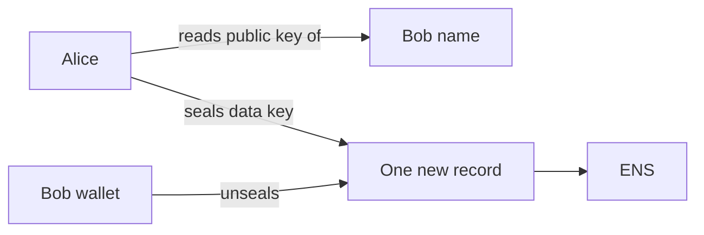

# 2. Share a secret with one person

Alice has a Stripe key. She wants Bob to have it too. This example shows that sharing needs nothing
from Bob. No invite, no key exchange, no message. Alice knows his ENS name, and that is enough. It
runs on the Sepolia test network with a made up key. Real credentials do not belong here.

## Who is involved

- Alice, `rewall-test-1.eth`. She owns the secret.
- Bob, `rewall-test-2.eth`. A teammate who should be able to read it.
- Cold storage, `rewall-test-3.eth`. Named as recovery, as always.

The secret lives at `stripe-key.rewall.rewall-test-1.eth`. Its type is `apikey`.

## What happens, step by step

Follow along in `examples/02-share-with-a-teammate/index.ts`.

**Connect twice.** A small `connect` helper builds one `Rewall` client per person. Each gets its own
wallet from the phrase in `.env`, Alice at position 0 and Bob at position 1, and its own `name`.

**Alice stores the key.** `alice.create` runs exactly as in
[example 1](/examples/01-store-and-read). A fresh data key, an encrypted blob, one sealed copy for
Alice and one for cold storage, and `overwrite: true` so the script can run again.

**Bob tries to read.** `bob.get` runs before any grant. Bob's wallet signs the identity message and
his private key is derived. The SDK looks for `rewall.key.<fingerprint>` under his fingerprint.
There is no such record. The call throws `NoWrapError`. The script catches it and prints the error
name.

**Alice grants Bob.** `alice.grant(SECRET, "rewall-test-2.eth")` does this:

1. Reads the secret's current records and checks Alice's signature over the reader lists. Then
   confirms the caller is the owner.
2. Reads `rewall.pubkey` on `rewall-test-2.eth`. That is the public key Bob published during setup.
3. Unseals Alice's own copy of the data key, then seals the data key to Bob's public key.
4. Writes one new record, `rewall.key.<fingerprint>` for Bob's fingerprint.
5. Adds Bob to `rewall.grantees` and his fingerprint to `rewall.holders`.
6. Signs the new lists and writes `rewall.auth.n`, `rewall.auth.keys` and `rewall.auth.sig`.

All of that goes in one transaction.

**Bob reads.** `bob.get` runs again. This time his `rewall.key.<fingerprint>` exists. He unseals
it, gets the data key, decrypts the blob, and prints the value.



## What to notice in the output

```
Alice stored the API key.
Bob cannot read it yet: NoWrapError
Alice granted rewall-test-2.eth.
Bob reads: sk_live_not_a_real_stripe_key
```

Bob did nothing. He did not accept an invite. He did not send Alice a key. He did not even need to
be online. Alice looked up a name, sealed one copy, and wrote one record.

## Why Bob is refused before the grant

Read access is not a permission that gets checked. There is no access list that a server consults.
Bob simply has no sealed copy of the data key, so there is nothing for him to decrypt.

The error says so directly. It is `NoWrapError`, not "denied". Nothing rejected Bob. There was just
nothing there for him. [How it works](/how-it-works#share) explains why reading is a matter of
holding a copy.

## What granting does not do

Granting does not re-encrypt anything. The blob stays exactly as it was. Only a new sealed key is
added.

That makes granting cheap, and it makes an important point. Adding a reader never touches the data
other readers rely on.

One edge to know. If Alice grants a name that is already on `rewall.grantees`, the SDK does not add
a second copy. It rotates the secret instead, because a plain re-grant would leave the old copy
alive on an unchanged data key. [Example 4](/examples/04-share-with-a-team) uses this on purpose.

## Try it

Run it twice. The second run creates the secret again with a fresh data key. `create` clears every
sealed copy from the previous run that the new secret does not keep. So Bob's old copy is gone, he
is refused again, and Alice grants him again. That is normal. Every `create` is a new secret in the
same place.

## How to run it

From the `examples/` folder, after `pnpm run setup`:

```bash
pnpm run 02
```

## Next

[3. Take access away](/examples/03-take-access-away) removes Bob, and shows what removing cannot
do.
