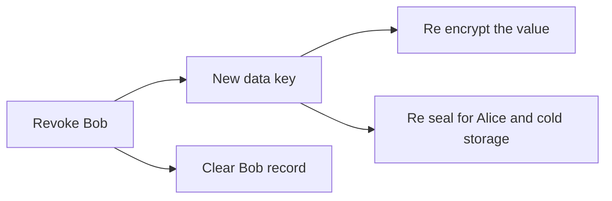

# 3. Take access away

Bob leaves. Alice revokes him. This example shows what revoking is, which is a rotation, and what it
cannot do, which is take back a value Bob already holds. It is the most important page in these
examples. It runs on the Sepolia test network with a made up token. Real credentials do not belong
here.

## Who is involved

- Alice, `rewall-test-1.eth`. She owns the secret.
- Bob, `rewall-test-2.eth`. Granted from the start, then removed.
- Cold storage, `rewall-test-3.eth`. Named as recovery.

The secret lives at `deploy-token.rewall.rewall-test-1.eth`. Its type is `apikey`.

## What happens, step by step

Follow along in `examples/03-take-access-away/index.ts`.

**Alice stores the token with Bob already on it.** `alice.create` takes `grantees: [BOB]` this
time, so the data key is sealed to Bob at creation. No separate grant is needed.

**Bob reads it.** `bob.get` returns the token. The script prints it.

**Bob keeps a copy.** The script calls `bob.get` once more and stores the result in a variable named
`stolen`. This is what a real leaver would do.

**Alice revokes Bob.** `alice.revoke(SECRET, BOB)` with no options means the individual grant. The
SDK does this:

1. Reads the secret's current records, including `rewall.grantees`, `rewall.subtrees` and
   `rewall.recovery`.
2. Checks that Bob is actually on `rewall.grantees`. If he were not, it would throw.
3. Removes him from that list and starts a rotation.
4. Makes a brand new data key and encrypts the token again under it. The result replaces
   `rewall.blob`.
5. Seals the new data key to everyone who stays, Alice and cold storage.
6. Clears Bob's `rewall.key.<fingerprint>` record by writing it empty.
7. Rewrites the lists, `rewall.holders`, and a fresh signature.

All in one transaction.



**Bob tries again.** `bob.get` throws `NoWrapError`. His fingerprint has no record any more.

**Alice still reads.** `alice.get` returns the token under the new data key.

**The script prints Bob's copy.** The `stolen` variable still holds the old value.

## What to notice in the output

```
Bob reads: ghp_not_a_real_deploy_token

Alice revoked rewall-test-2.eth.
Bob is locked out: NoWrapError
Alice still reads: ghp_not_a_real_deploy_token

Bob kept a copy of the old value: ghp_not_a_real_deploy_token
He did not even need to keep it. The old wrap and the old blob are in chain history forever,
so his key still opens them. Revoking protects the next value. Rotate the real token too.
```

Read the last lines. Bob already read the token, so revoking cannot reach into his notes. That much
is true of every secret manager.

## The honest part

Rewall has a sharper version of that problem. Bob did not need to write anything down. The
transaction that granted him access is still in chain history, and it contains his sealed copy of
the old data key. The block that held the old blob is still there too. His key opens both. He can
walk away, read nothing, come back in a year, and pull the value out of an archive node. An archive
node is a server that keeps every old state of the chain.

**Once a name has been granted, it can read that version of the secret forever.** Rotation replaces
the current value. It cannot unpublish the old one.

So when someone leaves, rotate the real credential as well. Change the deploy token at GitHub.
Rewall protects the next value, not the last one.

Decide what goes into Rewall with this in mind. Granting access is closer to handing someone a copy
than to lending them a key.

## Why a rotation and not a delete

You could imagine just deleting Bob's record. That would be worse. It would look like the door
closed while the blob his key opens sat there untouched.

Changing the data key is the only thing that closes the door on future values. That is why `revoke`
and `rotate` are the same operation inside the SDK.

## One thing to know

A name can hold three separate kinds of access to one secret. An individual grant, a subtree grant
through its parent, and a recovery entry. They use different keys, so `revoke` needs to know which
one you mean.

```ts
await alice.revoke(SECRET, BOB); // the individual grant
await alice.revoke(SECRET, TEAM, { subtree: true }); // the subtree grant
await alice.revoke(SECRET, VAULT, { recovery: true }); // the recovery entry
```

Passing both `subtree` and `recovery` at once is refused.

If a name is both a grantee and a recovery holder, revoking the grant alone would leave them
reading, because both use the same key. The SDK refuses that instead of quietly succeeding, and
tells you to take the recovery entry first.

Revoking the last recovery entry is also refused. A secret only its owner can open is one lost
wallet away from gone.

## How to run it

From the `examples/` folder, after `pnpm run setup`:

```bash
pnpm run 03
```

## Next

[4. Share with a whole team](/examples/04-share-with-a-team) grants to a group without naming
anyone in it.
