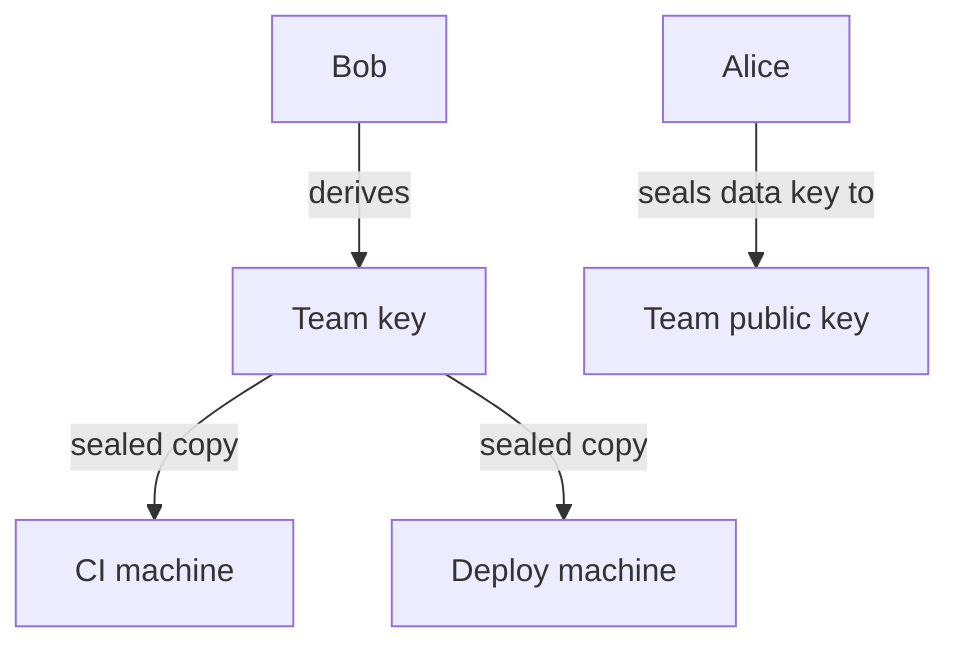

# 4. Share with a whole team

Alice grants a secret to Bob's team. She never learns who is on it. This example shows the subtree
grant, which is how a secret is shared with every name under a parent name at once. It runs on the
Sepolia test network with a made up value. Real credentials do not belong here.

## Who is involved

- Alice, `rewall-test-1.eth`. She owns the secret.
- Bob, `rewall-test-2.eth`. He runs a team of machines.
- CI, `ci.rewall-test-2.eth`. A machine under Bob's name.
- Deploy, `deploy.rewall-test-2.eth`. Another machine under Bob's name.
- Cold storage, `rewall-test-3.eth`. Named as recovery.

The secret lives at `team-secret.rewall.rewall-test-1.eth`. Its type is `generic`.

## The problem this solves

Bob runs two machines today. Tomorrow he might add a third.

Alice does not want to grant each one. She does not want to be asked again every time Bob's team
changes. She wants to say "Bob's team" once.

## What happens, step by step

Follow along in `examples/04-share-with-a-team/index.ts`.

**Connect four times.** The `connect` helper builds a `Rewall` client for Alice, Bob, CI and Deploy.
Each has its own wallet from the phrase in `.env` and its own `name`.

**Bob publishes a team key.** `bob.subtree.init()` derives a second keypair from Bob's own private
key plus a version number, which starts at 0. It writes the public half to Bob's name as
`rewall.subtree.pubkey`, and the version as `rewall.subtree.v`.

**Bob hands the team key to each machine.** `bob.subtree.distribute([CI, DEPLOY])` reads
`rewall.pubkey` on each machine, seals the team private key to it, and writes the result on that
machine's name as `rewall.subtree.key`. Only that machine can open its copy. Both writes go in one
transaction, because the machines share Bob's resolver.

**Alice grants the team.** `alice.create` takes `subtreeGrantees: [BOB]` instead of `grantees`. The
SDK reads `rewall.subtree.pubkey` on `rewall-test-2.eth` and seals the data key to it. That is one
record, `rewall.key.<fingerprint>` for the team key's fingerprint, and Bob's name goes on
`rewall.subtrees`. Alice never sees the list of machines and does not need to.



**Both machines read.** `ci.get` and `deploy.get` each work the same way. The SDK reads
`rewall.subtree.key` on the machine's own name, unseals it with the machine's identity, and now
holds two keys, its own and the team's. It looks for a `rewall.key.<fingerprint>` record under
either fingerprint, finds the team one, and decrypts.

**Bob removes Deploy.** `bob.subtree.rotate()` adds one to the version and derives a new team key.
It writes the new `rewall.subtree.pubkey` and `rewall.subtree.v` on Bob's name. Every copy he handed
out is now a copy of the old key. `bob.subtree.version()` reads the new number back for the log.

**Alice re-grants.** `alice.grant(SECRET, BOB, { subtree: true })` sees that Bob is already on
`rewall.subtrees`. Instead of adding a second record, it rotates the secret. New data key, new blob,
the data key sealed to the new team key, the old team key's record cleared. This is what actually
locks the removed machine out.

**Bob hands the new key to CI only.** `bob.subtree.distribute([CI])` overwrites CI's
`rewall.subtree.key` with the new team key. Deploy keeps the old one.

**CI reads, Deploy cannot.** `ci.get` succeeds. `deploy.get` unseals its old copy fine, but the old
team key's fingerprint no longer has a record, so it throws `NoWrapError`.

## What to notice in the output

```
Bob shared his team key with ci.rewall-test-2.eth and deploy.rewall-test-2.eth.

Alice granted the secret to rewall-test-2.eth and everything under it.
ci.rewall-test-2.eth reads: shared-across-the-whole-team
deploy.rewall-test-2.eth reads: shared-across-the-whole-team

Bob rotated the team key to version 1.
ci.rewall-test-2.eth still reads: shared-across-the-whole-team
deploy.rewall-test-2.eth is out: NoWrapError
```

The version number climbs by one every time you run the example, because each run bumps it again.

Note the cost. Between Alice's re-grant and the second `distribute`, CI is locked out too. Bumping
the version and re-granting locks out everyone until Bob hands out the new key. It is not surgical.
That is the trade for Bob storing nothing.

## Where the team key comes from

Bob does not generate and store it. It is derived, as `SHA-256` over the text `Rewall subtree v1`,
the version number, and Bob's own private key. He can always work it out again. Nothing to back up,
nothing to lose. Changing the version is what makes a new one. The private half exists only in
memory while a call runs.

## How to run it

From the `examples/` folder, after `pnpm run setup`:

```bash
pnpm run 04
```

Both Alice's and Bob's wallets send transactions here.

## Next

[5. Recover a lost wallet](/examples/05-recover-a-lost-wallet) shows what happens when a key is gone
for good.
