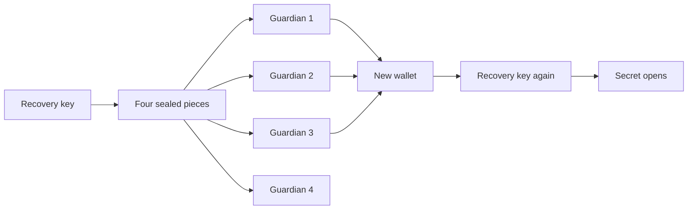

# 5. Recover a lost wallet

Alice loses her laptop, and her wallet goes with it. Her secrets are still on chain, encrypted, and
her new wallet cannot open any of them. This example shows how a group of guardians brings a secret
back. It also shows why no single guardian can do it alone, and why a forged piece cannot spoil the
result.

This runs on Sepolia, a test network. Do not put a real credential in it.

## Who is involved

- Alice, `rewall-test-1.eth`, wallet 0. She owns the secret, then loses this wallet.
- Alice again, `rewall-test-1.eth`, wallet 9. Her new wallet, under the same name.
- Four guardians, each holding one piece. `rewall-test-2.eth` at wallet 1, `rewall-test-3.eth` at
  wallet 3, `ci.rewall-test-2.eth` at wallet 4 and `deploy.rewall-test-2.eth` at wallet 5.

The threshold is three. `THRESHOLD` in `index.ts` sets it. The secret is
`lost-wallet-demo.rewall.rewall-test-1.eth`.

## The problem

Alice's private key is never stored. Her wallet signs one fixed message, and the key is derived from
that signature each time. No wallet means no signature, so no key. The encrypted value sits on chain
forever and nobody can open it.

Example 1 named a second wallet as the recovery holder. That works, but Alice now has two things to
lose instead of one. And whoever holds the second wallet can read everything on their own.

## What guardians do instead

A recovery key is made and split into four pieces. Each piece is sealed to one guardian. Then the
recovery key is wiped. Nobody holds it, not even Alice. It exists again only when three guardians
hand their pieces to the same new key.



## Step by step

**Alice sets up her guardians.** `alice.guardians.init(names, THRESHOLD)` reads each guardian's
`rewall.pubkey`. It makes a random recovery key and splits it with Shamir secret sharing. That is a
piece of maths that turns one key into pieces, where any three of four rebuild it and two reveal
nothing. Each piece is sealed to its guardian's public key. The call writes `rewall.recovery.pubkey`,
`rewall.recovery.k`, `rewall.guardians` and one `rewall.guardian.<fingerprint>` per guardian on
`rewall-test-1.eth`. The private half is wiped from memory before the call returns.

**Alice stores a secret.** `alice.create` takes `recovery: [alice.guardians.entry()]`. The entry is
the string `guardians:rewall-test-1.eth`. The SDK reads `rewall.recovery.pubkey` from that name and
wraps the data key to it. So the secret opens for Alice and for the recovery key, and for nobody
else. `alice.get` reads it back to prove it worked.

**Alice loses her wallet.** The script connects wallet index 9 under the same name.
`newAlice.get(SECRET)` fails with `NoWrapError`. There is no `rewall.key.<fingerprint>` record for
the new key, so there is nothing to unseal.

**Three guardians re-seal their pieces.** `newAlice.identity()` gives the new public key. Each of the
first three guardians calls `guardians.reshare("rewall-test-1.eth", newKey)`. That reads the
guardian's own `rewall.guardian.<fingerprint>` record from Alice's name, opens it, and seals the
piece again to the new key. The piece is in the clear only inside the guardian's memory, and only
for a moment. Each call returns one string, and the script collects the three.

**Alice rebuilds the recovery key.** `newAlice.guardians.recover(pieces)` reads
`rewall.recovery.pubkey` and `rewall.recovery.k` from her name. It opens each piece with the new
key. Then it tries every group of exactly three and checks each result against the published public
key. The first match comes back as an identity with a fingerprint.

**She reads the secret.** `readTexts` fetches `rewall.blob` and the `rewall.key.<fingerprint>`
record for the recovery key. `openSecret(records, recovered, SECRET)` unseals the data key and
decrypts the blob in memory.

## What to notice in the output

```
Alice set up 3 of 4 guardians.
Alice reads: the-value-alice-cannot-afford-to-lose

Alice's new wallet cannot read anything: NoWrapError
rewall-test-2.eth handed over their piece.
rewall-test-3.eth handed over their piece.
ci.rewall-test-2.eth handed over their piece.

Rebuilt the recovery key: <fingerprint>
Alice reads again: the-value-alice-cannot-afford-to-lose
```

The new wallet fails first, because the secret was never wrapped for its key. After three pieces
arrive, the same value comes back. Two things are worth trying.

**Too few pieces.** Set `THRESHOLD` to 4 and change `GUARDIANS.slice(0, THRESHOLD)` in the loop to
`GUARDIANS.slice(0, 3)`, so only three guardians hand over a piece. The SDK stops before any maths
runs, with `recovery needs 4 pieces, only 3 were supplied`. It never hands back a key that fails
quietly later. With too few pieces the underlying maths returns a plausible looking key rather than
an error, which is why the count is checked first.

**Forged pieces.** Anyone who knows Alice's new public key can seal a fake piece to it. The SDK
never trusts a rebuilt key on its own. It checks every candidate against `rewall.recovery.pubkey`. A
forged piece fails that check, and if three honest pieces exist among those supplied, they are found
and used. If no group works, the call throws `RecoveryFailedError`.

## After recovery

The example stops at the read. SPEC section 5 says what comes next in real use. Publish a new
`rewall.pubkey` for the new wallet, then run `rotate` on every secret. After that the new wallet
holds its own wrap again, and the recovery key goes back to being a backup.

## Guardians who cannot write their own name

The example passes the re-sealed strings around in memory. The SDK also has an on chain path.
`guardians.approve` publishes the piece on the guardian's own name as `rewall.reshare.<fingerprint>`,
and `guardians.collect` gathers those records for the new owner. A subname such as
`ci.rewall-test-2.eth` cannot write its own records, so it hands the string over instead.

## Choosing a threshold

Two is the minimum the SDK allows, because one would let a single guardian recover alone. Twelve
guardians is the most. A higher threshold protects against a dishonest guardian, a lower one against
an unreachable guardian. Three of five is a reasonable place to start.

## Run it

You need `examples/.env` with a throwaway twelve word phrase and the names from `pnpm run setup`.
The [examples overview](/examples) covers that.

```bash
cd examples
pnpm run 05
```

Next: [6. Pay a name](/examples/06-pay-a-name).
