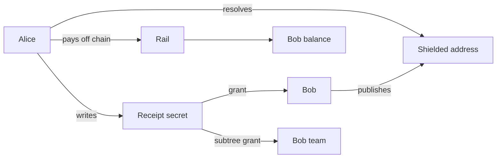

# 6. Pay a name

Alice owes Bob a payment. She knows his ENS name and nothing else. She pays him with no transaction
on chain. Then she decides who may know it happened. Bob is not on that list until she puts him
there.

This runs on Sepolia, a test network, with test tokens. Do not use real money or real credentials.

## Who is involved

- Alice, `rewall-test-1.eth`, wallet 0. She pays, then writes the receipt.
- Bob, `rewall-test-2.eth`, wallet 1. He gets paid.
- Charlie, `ci.rewall-test-2.eth`, wallet 4. A machine on Bob's team.
- A stranger, wallet 2, with no name. Holds a key and nothing else.
- Cold storage, `rewall-test-3.eth`, wallet 3. Recovery on the receipt.

## The rail

The payment does not run on Ethereum directly. It runs on a private transfer rail. A rail is a
service with a vault contract on chain. Users deposit tokens into the vault, then move balances
between each other off chain with signed requests. Only deposits and withdrawals touch the chain.

The real rail is Chainlink's private transfer demo service on Sepolia. Its indexer is not crediting
deposits at the moment, so the repo ships a local stand in at `rail/` that speaks the same wire
format. The SDK uses only the five endpoints the real service documents, `/balances`,
`/transactions`, `/shielded-address`, `/private-transfer` and `/withdraw`. The
[rail page](/components/rail) says what is real and what is local. The rail is a test harness, not a
part of Rewall.

## Step by step

Two SDK classes do the work. `Transfers` talks to the rail. It signs every request with EIP-712, a
standard for signing structured data, so the rail knows which wallet is asking. `Rewall` talks to
ENS as in every other example.

**Check Alice can pay.** `Transfers.held(TOKEN)` returns her balance on the rail in base units, the
smallest unit of the token. If she holds less than `AMOUNT`, the script stops before anything is
written to chain and says how to fund her.

**Bob publishes a shielded address.** `Transfers.shieldedAddress()` asks the rail for a fresh address
for Bob. It looks like an ordinary Ethereum address. It has no code, no balance and has never sent a
transaction. Nothing on chain connects it to him. `bob.publishShielded(address)` writes it to
`rewall-test-2.eth` as `rewall.shielded`.

**Alice resolves the name.** `alice.shieldedOf("rewall-test-2.eth")` reads that record. That is all
she ever learns about Bob.

**Alice pays.** `Transfers.pay(shielded, TOKEN, AMOUNT)` posts a signed private transfer to the rail
and returns a transaction id. No block carries it and no event is emitted. Bob's balance on the rail
goes up, which is how he knows he was paid.

**Alice writes a receipt.** The transfer left no trace, so this receipt is the only account of who
paid whom and how much. `receiptLabel(transactionId)` makes a short label, `r-` plus the first twelve
label safe characters of the id. The receipt lives at that label under `rewall.rewall-test-1.eth`.
`encodeReceipt` builds a small JSON payload holding the amount, the token, the counterparty name,
the transaction id and the direction `sent`. `alice.create` stores it with `type: "receipt"` and
`rewall-test-3.eth` as recovery.

**Nobody else can read it yet.** Bob and Charlie each call `get` on the receipt. Both fail with
`NoWrapError`. Bob saw a number move and nothing more.

**Alice picks the audience.** `alice.grant(receipt, "rewall-test-2.eth")` seals the data key to Bob.
`alice.grant(receipt, "rewall-test-2.eth", { subtree: true })` seals it to Bob's team key, the one he
set up in [example 4](/examples/04-share-with-a-team). Charlie holds a copy of that team key, so he
can read too.

**Both read it.** `decodeReceipt(await reader.get(receipt))` checks the payload and returns its
fields. The stranger still fails with `NoWrapError`.



## What to notice in the output

The script prints Bob's balance before and after, and says nothing reached the chain. Then two
refusals, one for Bob and one for Charlie, each ending in `NoWrapError`. Then the grants, and both
names read the same line: `sent`, the amount, and `rewall-test-2.eth`. The stranger fails at the end.

Bob is on the list because Alice put him there, not because he was paid. She could have told his
bookkeeping system and not him, or a third party and neither of them. The list is hers, chosen per
payment.

Run it twice. Bob publishes a different shielded address each time, so two payments to him cannot be
linked by the address. That is why `publishShielded` is meant to be called often rather than once.

## What is private and what is public

Private:

- The transfer itself. No transaction, no event, no amount on chain.
- Who paid whom, how often and for how much. Only the rail's ledger holds that, and only the
  receipt's readers see it by name.

Public:

- Deposits into the vault and withdrawals out of it. They are ordinary transactions with visible
  amounts. With few users they line up with transfers by timing and amount. The vault is not a
  mixer, which is why this is semi confidential and not anonymous.
- That a receipt exists. `rewall.type` says `receipt`, and the label sits under Alice's namespace.
- How many can read it, and often who. There is one `rewall.key.<fingerprint>` per reader,
  `rewall.holders` lists them, and `rewall.grantees` and `rewall.subtrees` name them in plain text.
  Hiding that needs fixed wrap slots with random filler, which is not built.
- Cold storage. `rewall-test-3.eth` is the recovery name on every secret in these examples, so it
  can read every receipt. That is what a backup is, but it is part of the audience.

## Run it

Start the rail first. The one time setup is on the [rail page](/components/rail). After it:

```bash
cd rail
pnpm run deploy
pnpm run serve
```

`pnpm run deploy` prints the vault and the token it registered. Put them in `examples/.env` as
`VAULT_ADDRESS` and `TOKEN_ADDRESS`. `.env.example` already sets `RAIL_API` to
`http://127.0.0.1:8788`, which is where `pnpm run serve` listens. The script stops if it is missing.
Leave the server running and open another terminal.

Run [example 4](/examples/04-share-with-a-team) first. The subtree grant needs the team key Bob
publishes there, and Charlie's copy of it.

```bash
cd examples
pnpm run 06
```

`AMOUNT` in `index.ts` is `10n ** 18n` base units. The rail's default token is Circle's Sepolia
USDC, which has six decimals, so that is far more than `pnpm run deposit` puts in. Point
`TOKEN_ADDRESS` in `rail/.env` at an eighteen decimal ERC-20 before deploying, or lower `AMOUNT` in
both `06-pay-a-name/index.ts` and `07-share-a-treasury/index.ts`.

If Alice has no balance on the rail, the script stops, prints her address and says what to do. In
`rail/`, `pnpm run deposit` puts tokens into the vault from the wallet at `DEPLOYER_INDEX`, and the
rail credits that same wallet. The deployer needs the token first, because nothing in the rail mints
it. `DEPLOYER_INDEX` defaults to 0, so when `rail/.env` and `examples/.env` hold the same phrase,
that wallet is Alice and she is funded. If you moved the deployer to another index, that wallet pays
her with `Transfers.pay`.

Next: [7. Share a treasury](/examples/07-share-a-treasury).
