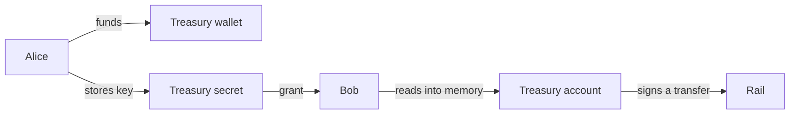

# 7. Share a treasury

Alice and Bob want a shared wallet. Neither wants to email a private key. So the key becomes a Rewall
secret. Alice funds the wallet, stores its key and grants Bob. Bob reads the key into memory and
spends from it. Nobody pastes a key anywhere.

This runs on Sepolia, a test network, with test tokens. Do not use real money or real credentials.

## Who is involved

- Alice, `rewall-test-1.eth`, wallet 0. She funds the treasury and stores its key.
- Bob, `rewall-test-2.eth`, wallet 1. He reads the key and spends.
- The treasury, wallet 7, with no name. It holds the balance and is never used directly.
- A stranger, wallet 2, with no name. Tries to read and fails.
- Cold storage, `rewall-test-3.eth`, wallet 3. Recovery on the secret.

The secret is `treasury.rewall.rewall-test-1.eth`, with `rewall.type` set to `privkey`. Money moves
on the same rail as [example 6](/examples/06-pay-a-name).

## Step by step

**Fund the treasury.** `Transfers.held(TOKEN)` checks the treasury's balance on the rail. If it is
below `AMOUNT`, Alice pays it. First she checks she holds at least twice `AMOUNT`, then
`Transfers.pay(treasury.address, TOKEN, 2n * AMOUNT)` moves that across. This is a private transfer
on the rail, so it is not a chain transaction. If Alice has nothing, the script stops with the same
funding advice as example 6.

**Store the key as a secret.** `alice.create` stores the treasury's private key, taken from
`treasury.getHdKey().privateKey` and encoded with `toHex`. The options are `type: "privkey"`,
`grantees: ["rewall-test-2.eth"]` and `recovery: ["rewall-test-3.eth"]`. The data key is wrapped for
Alice, Bob and cold storage. There is no `overwrite`, so a second run gets `SecretExistsError` and
reuses what is there. Rewriting would hand every reader a new wrap for no reason.

**Bob reads it.** `bob.get(SECRET)` returns the hex key as bytes. `privateKeyToAccount` from viem
rebuilds the account from it, in memory. Bob never had the key before, and it is never written to
his disk.

**Bob spends.** A `Transfers` built on the rebuilt account calls `held`, then
`pay(wallet(1).address, TOKEN, AMOUNT)` to send to Bob's own wallet, then `held` again. The treasury
signs the EIP-712 request that authorises the transfer. That is the only thing it ever does.

**A stranger cannot.** `stranger.get(SECRET)` fails with `NoWrapError`.



## What to notice in the output

The first line is the treasury's balance. Then either
`Alice stored the treasury key and granted rewall-test-2.eth` or, on a second run,
`treasury.rewall.rewall-test-1.eth already holds the key`. Then Bob opens the treasury, and the
script prints its address, followed by the balance before and after his spend. The stranger fails
last.

The treasury wallet at index 7 is never used directly by anyone. It signs from inside Bob's process,
and only because Bob could open the secret.

## Why this is different from sending someone a key

A key you send is a key you cannot take back. It sits in a chat log or a password manager forever,
and you have no idea how many copies exist.

Here the key lives in one place, encrypted, wrapped for exactly the people who should have it.
Adding a signer is a `grant`. Removing one is a rotation. `revoke` makes a fresh data key and a
fresh blob, and the removed wrap stops working.

That does not unlearn the key from anyone who already opened it. That is the same caveat as
[example 3](/examples/03-take-access-away). A signer who leaves still knows the treasury key. So the
real fix is a new treasury key, and `rotate` accepts a new plaintext for exactly that. What Rewall
gives you is a list you control and can change, rather than a secret you have lost track of.

## Why the treasury never needs gas

Gas is the fee for a chain transaction. The treasury never sends one. It only signs, off chain, to
authorise transfers on the rail. The one leg that costs gas is redeeming a withdrawal ticket,
`pnpm run redeem <ticket>` in `rail/`, and whoever redeems pays that themselves. So a shared wallet
can hold a balance without anyone topping it up with ether.

## What is private and what is public

Private:

- The treasury's balance and every transfer from it. Those live in the rail's ledger, off chain.
- The key itself, encrypted in `rewall.blob`.

Public:

- That `treasury.rewall.rewall-test-1.eth` exists and holds a `privkey`.
- That `rewall-test-2.eth` is on its `rewall.grantees` list.
- The deposit that put tokens into the vault in the first place, with its amount.
- The treasury's address, to anyone who can open the secret. The script prints it.

## Run it

The rail must be running. See the [rail page](/components/rail) for how to start it. Alice needs a
balance on the rail of at least twice `AMOUNT`. [Example 6](/examples/06-pay-a-name) explains how
she gets one, and this example draws on the same balance.

```bash
cd examples
pnpm run 07
```

Run it twice. The second run finds the secret already there and reuses it.

Next: [8. Grant a machine](/examples/08-grant-a-machine).
