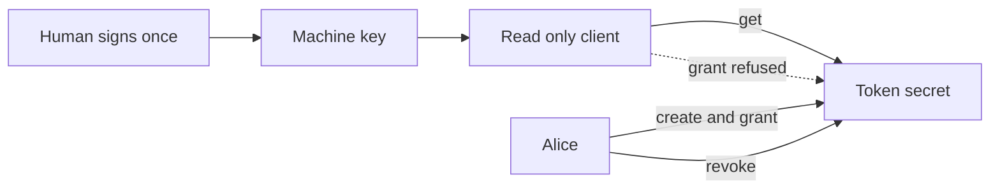

# 8. Grant a machine

Alice's CI runs at night with nobody watching. It needs a deploy token. Alice grants the machine's
ENS name the same way she granted Bob in example 2. The machine reads the token with no wallet at
all. It cannot pass the token on, and it loses access the moment Alice revokes. Then the example says
plainly what it did not solve.

This runs on Sepolia, a test network. The token is a fake string. Do not put a real one in.

## Who is involved

- Alice, `rewall-test-1.eth`, wallet 0. She owns the token.
- CI, `ci.rewall-test-2.eth`, wallet 4. A build server on Bob's team.
- Cold storage, `rewall-test-3.eth`, wallet 3. Recovery on the secret.

The secret is `ci-token.rewall.rewall-test-1.eth`. Its type is `apikey`, and its `rewall.allow`
record is `api.github.com`.

## Step by step

**A human derives the machine's key once.** `ciAccount.signTypedData(IDENTITY_TYPED_DATA)` signs the
fixed Rewall identity message with the CI wallet. `deriveIdentity(signature)` turns that signature
into the machine's X25519 key. This is the only step that needs a wallet, and it happens at a
keyboard.

**The machine gets a read only client.**
`new Rewall({ publicClient, name: "ci.rewall-test-2.eth", universalResolver, identity })`. No
`walletClient` and no `account`. Every write and every signature inside the SDK passes one check,
and without a wallet that check throws `ReadOnlyError`.

**Alice stores and grants.** `alice.create` with `type: "apikey"`,
`grantees: ["ci.rewall-test-2.eth"]`, `recovery: ["rewall-test-3.eth"]`, `allow: ["api.github.com"]`
and `overwrite: true`. Granting a machine works exactly as granting Bob did in
[example 2](/examples/02-share-with-a-teammate). The only difference is that here the grant rides in
`create` through `grantees` rather than a separate `grant` call. Rewall has no idea one is a person
and the other is a build server. A participant is an ENS name with a published key, and that is the
whole definition.

**The machine reads.** `ci.get(SECRET)` finds its own `rewall.key.<fingerprint>` record, unseals the
data key and decrypts the blob.

**The machine tries to pass it on.** `ci.grant(SECRET, "rewall-test-3.eth")` throws `ReadOnlyError`.
The message says this client needs a `walletClient` and an `account`. The machine holds exactly one
capability, reading, and only for the secrets it was granted. It cannot widen its own access or
anyone else's.

**Alice revokes.** `alice.revoke(SECRET, "ci.rewall-test-2.eth")` rotates. A new data key, a new
blob, new wraps for Alice and cold storage, and the machine's wrap cleared.

**The machine is out.** `ci.get(SECRET)` now throws `NoWrapError`. `alice.get(SECRET)` still
returns the token.



## What to notice in the output

```
Alice granted ci.rewall-test-2.eth, a machine that never signs anything.
The machine reads: ghp_not_a_real_ci_token
The machine cannot pass it on: ReadOnlyError

Alice revoked ci.rewall-test-2.eth.
The machine is locked out: NoWrapError
Alice still reads: ghp_not_a_real_ci_token

One thing did not get solved here. The machine's key was derived by a human and handed over,
so it now lives in that process, and read access can never be taken back from whoever holds it.
Revoking protects the next value, not the ones already read. See cre/ for where that key can live
instead: an enclave that is granted the same way and holds the key on no machine at all.
```

Two refusals, and they are different. `ReadOnlyError` comes from the client. It reads the records,
then stops at the point where it would need to sign, so no transaction is sent. `NoWrapError` comes
from the records, because the wrap is gone.

`rewall.allow` is written but not used here. `get` does not enforce it. The
[MCP server](/components/mcp) does, when an agent uses a secret through a tool.

## The honest part

Read the last four lines of the output. The machine's key had to come from somewhere. A human derived
it and put it on the runner. It now lives in that process and in whatever backs that process up.

Read access in Rewall is cryptographic. It can never be taken back from whoever holds the key.
Revoking protects the next value, exactly as in [example 3](/examples/03-take-access-away). If the
runner is compromised, the attacker holds the machine's key permanently. They can pull every value it
was ever granted out of an archive node.

Scoping a machine to its own name shrinks the blast radius. It is worth doing. It is not a fix. The
key on the machine is the problem, and no amount of scoping removes it.

## Where that gets solved

The key has to live somewhere. The one place that is not a machine anybody logs into is a hardware
enclave, an isolated environment that the operator of the machine cannot look inside.

`cre/` is a Chainlink CRE Confidential Workflow. It is granted a secret with the same `grant` call as
the machine above, and it opens the secret inside an AWS Nitro enclave. Its key lives in the Vault
DON and is released into the enclave for one handler run. It was generated on an operator machine
and uploaded there, so an operator plus the enclave holds it, not the enclave alone. Revoking it is
the ordinary rotation you just watched.

One honest note. The workflow runs today under `cre workflow simulate`, which runs the handler
locally and says so on every run. Deploying to a real enclave needs private beta access. The
[CRE page](/components/cre) covers what is real and what is not.

## One thing to know about subnames

`ci.rewall-test-2.eth` is a subname. Its parent, `rewall-test-2.eth`, writes its records, and could
republish its `rewall.pubkey` at any time. Alice's next rotation would then seal the fresh data key
to whoever the parent chose.

That is why the signed list binds a fingerprint to every name, in `rewall.auth.keys`, and not just
the name. A rotation that resolves a different key than the one Alice approved stops with
`KeyChangedError` rather than sealing to it. [How it works](/how-it-works#share) covers the signed
list.

## Run it

```bash
cd examples
pnpm run 08
```

The names come from `pnpm run setup`, described on the [examples overview](/examples).

This is the last example. The [MCP server](/components/mcp) is where a machine uses a secret without
ever seeing it, which is the next thing to read.
