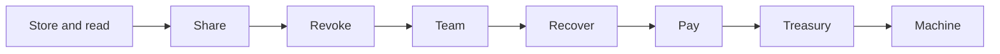

# Examples

Eight short programs. Each one is a real scenario, runs against the real Sepolia test network, and
fits on one screen. They live in the `examples/` folder of the
[repo](https://github.com/oynozan/rewall). Read them in order. Each page explains what happened and
why.

|                                                                | What it shows                                                            |
| -------------------------------------------------------------- | ------------------------------------------------------------------------ |
| [1. Store and read](/examples/01-store-and-read)               | Keep a database connection string somewhere other than a `.env` file     |
| [2. Share with a teammate](/examples/02-share-with-a-teammate) | Give one person access, using only their ENS name                        |
| [3. Take access away](/examples/03-take-access-away)           | Revoke someone, and what revoking cannot do                              |
| [4. Share with a team](/examples/04-share-with-a-team)         | Grant to a whole group without naming anyone in it                       |
| [5. Recover a lost wallet](/examples/05-recover-a-lost-wallet) | Get back in when your key is gone                                        |
| [6. Pay a name](/examples/06-pay-a-name)                       | Pay by ENS name, then choose who may know you did                        |
| [7. Share a treasury](/examples/07-share-a-treasury)           | A shared wallet whose signing key is itself a secret                     |
| [8. Grant a machine](/examples/08-grant-a-machine)             | A build server reads a secret with no wallet, and why that is not enough |



## What Rewall is

A secret manager with no server.

Your secret is encrypted on your machine and stored in ENS records. ENS is the naming system on
Ethereum, and a record is a small piece of text attached to a name. Access is granted to ENS names.
There is no account to make, no company to trust, and nobody who can read your secrets except the
names you encrypted them to. [How it works](/how-it-works) has the detail.

## Setup

You need Node 22 or newer. The `sdk/` folder must be built first, because the examples import its
`dist` output. [Get started](/get-started) covers that.

Then, inside `examples/`:

```bash
pnpm install
cp .env.example .env
```

Put the twelve word phrase whose wallets hold the test names in `.env` as `REWALL_MNEMONIC`. A
twelve word phrase is the seed a wallet is made from. Each test name is held by a wallet at a fixed
position in that phrase. `setup.ts` registers subnames into Alice's own registry as that wallet. So
a fresh random phrase cannot run it. Never use a phrase that holds real money. Every example derives
its wallets from it. `SEPOLIA_RPC_URL` is optional and falls back to a free public endpoint.

Alice's wallet needs a little Sepolia ETH, about 0.05 is plenty. Bob's wallet needs some too,
because he sends transactions in examples 4 and 6. Sepolia ETH is test money with no value.
Everything else costs nothing, because the test tokens mint freely.

Then register the names the examples write to:

```bash
pnpm run setup
```

`setup.ts` registers five subnames under `rewall.rewall-test-1.eth`, one for each secret examples 1
to 5 create: `database`, `stripe-key`, `deploy-token`, `team-secret` and `lost-wallet-demo`.
Examples 6, 7 and 8 use other names, which `create` registers on its own when they are missing.
Setup then publishes a public key as `rewall.pubkey` on every name in the cast. It skips anything
that already exists, so it is safe to run again.

## Running each one

```bash
pnpm run 01
pnpm run 02
pnpm run 03
pnpm run 04
pnpm run 05
pnpm run 08
```

Each command runs one `index.ts` with `node --env-file=.env --experimental-strip-types`. There is no
build step in this folder.

## Examples 6 and 7 need one more thing

They move money, so they need a private transfer rail. A rail is the service that holds deposits
and moves them between shielded addresses. Chainlink's demo service is the real one, but its
indexer is not currently crediting deposits. So there is a local stand in at
[rail/](/components/rail). Start it, then put the three values it prints into `.env` here, as
`RAIL_API`, `VAULT_ADDRESS` and `TOKEN_ADDRESS`.

The rail has its own setup first, Foundry, a `forge install`, `pnpm install` and its own `.env`.
[rail/](/components/rail) lists the steps. Then deploy and serve:

```bash
cd ../rail && pnpm run deploy && pnpm run serve
```

```bash
pnpm run 06
pnpm run 07
```

## The cast

Everyone here is an ENS name with a wallet behind it. The wallets all come from the one phrase in
`.env`, each at a fixed position.

| Who          | Name                       | Their part                          |
| ------------ | -------------------------- | ----------------------------------- |
| Alice        | `rewall-test-1.eth`        | Owns the secrets                    |
| Bob          | `rewall-test-2.eth`        | A teammate, and later a team        |
| Cold storage | `rewall-test-3.eth`        | A backup wallet Alice keeps offline |
| CI           | `ci.rewall-test-2.eth`     | A machine on Bob's team             |
| Deploy       | `deploy.rewall-test-2.eth` | Another machine on Bob's team       |

## Three ideas that explain everything else

**A secret is encrypted once, for many people.** One random key encrypts the value. That key is
then wrapped separately for each reader. Wrapping means sealing the key so only one reader can open
it. Adding a reader adds one small record and leaves the encrypted value untouched.

**Reading is not a permission.** Nothing checks whether you are allowed. You either hold a wrapped
copy of the key or you do not. There is no list to be on and no server to ask.

**Revoking means re-encrypting.** Since there is no permission to withdraw, the only way to shut
someone out is to change the key and not give them the new one. This is why revoke and rotate are
the same operation.

## What this does not protect you from

Worth knowing before you trust it with anything real.

- Someone who already read a secret still knows it. Revoking is not amnesia.
- If you let someone write your records, they can swap the encrypted value for one of their own.
  Only delegate writes to someone you would trust with the contents.
- Everything is public except the plaintext. Who granted what, and when, is visible to anyone
  reading the chain.
- Payments hide who paid whom, not that you used the vault at all. Deposits and withdrawals are
  ordinary transactions with visible amounts. That is why example 6 calls this semi confidential
  rather than anonymous.
- This runs on Sepolia, a test network. Do not put a real credential in it.
