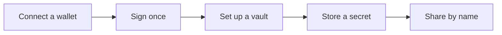

# Get started

There is nothing to install. Open [rewall.me](https://rewall.me) and click Dashboard. Everything
below happens in that tab.

Rewall runs on Sepolia, a test network for Ethereum. The coins on it are free and worth nothing.
That makes it a safe place to learn and the wrong place for a real credential. Store test values
while it is on Sepolia.



## Connect a wallet

A wallet is a program that holds a key and signs messages for you. The dashboard connects through
Privy, a sign in service that can also make a wallet for you. Bring a wallet you already have, or
sign in with an email address or Google and have one made for you. Either way it is an ordinary
key, which is the only kind Rewall can derive an identity from.

MetaMask is the supported wallet. Other ordinary wallets are expected to behave the same but have
not been checked. A smart contract wallet is a contract rather than one plain key, and an MPC wallet
splits its key across several parties. Both sign differently every time, so the dashboard detects
that and refuses them. Connecting reads your public address and signs nothing.

## Sign once

The first time you read or write, your wallet asks you to sign one message with two fields.

```text
purpose  Derive the X25519 key that unseals secrets shared with this wallet
warning  Sign this only in Rewall, whoever collects it reads every secret shared with you forever
```

That signature is your key. The dashboard hashes it into an encryption key, keeps it in memory for
the tab, and never stores it. The same wallet always gives the same signature, so the same key comes
back next time. On your first unlock in a browser the dashboard asks twice and checks the answers
match.

The warning is literal. Anyone who obtains that signature can read everything ever shared with you,
forever. Sign it on rewall.me and nowhere else.

The key locks after fifteen minutes idle, when you switch wallets, and when you close the tab. The
wallet panel in the sidebar shows Unlocked or Locked and has a Lock button.

## Set up a vault

Secrets live under an ENS name you own. ENS is the naming system on Ethereum. If your wallet has no
name yet, the dashboard shows a banner that says You need a vault. Click Set up my vault to open a
four step wizard at `/dashboard/setup`. The project pays for all of it, up to a cap.

1. **Test ETH.** Every change on Sepolia costs a little gas, the fee for writing to the chain. Click
   Send me test ETH and the faucet sends a small amount, once. The defaults in the code are 0.005
   Sepolia ETH and 1 test USDC.
2. **Pick your name.** Five or more letters, digits or hyphens. It becomes `yourname.eth`, and your
   secrets will sit at `something.rewall.yourname.eth`. Click Claim it and sign the message above.
   The project reserves the name for one year and deploys your own `PermissionedResolver`, the
   contract that holds your records, with your public key already on it as `rewall.pubkey` and your
   recovery key next to it as `rewall.recovery.pubkey`.
3. **Your recovery phrase.** The wizard shows the 24 words it made when you clicked Claim it. Their
   public key is the recovery key on your name, and secrets you store are sealed to it too. Copy or
   download the words and tick the box. A sixty second timer runs meanwhile, because a name is
   committed before it is revealed so nobody can take it first.
4. **Finish.** The name, its registry and its resolver are handed to your wallet, and the project
   gives up its own roles. Nothing is held by Rewall.

Already own a name on Sepolia? Click I already own a name, type it, and the dashboard checks that
the registry agrees it is yours.

## Store your first secret

Open Secrets and click Store a secret.

- **Name** is a short label. `stripe-key` becomes `stripe-key.rewall.yourname.eth`. Labels are
  public, so pick one you do not mind the world reading.
- **Value** is the secret itself.
- **Type** is one of Secure note, API key, Password, Database URL, SSH key, Certificate, Private
  key, Seed phrase, OAuth token, Webhook or Env variable. Authenticator accounts have their own panel.
- **Recovery and sharing** is optional. Leave Recovery name empty and your recovery phrase is used.
  If you brought a name you already owned, it has no recovery phrase. The field is then required, so
  type another ENS name here as the recovery holder. Share with takes a comma separated list of ENS
  names.

Click Store secret. The value is encrypted in your browser, sealed to your key and your recovery
key, and written to Sepolia in one transaction your wallet asks you to confirm.

Click any secret to open it. Reveal decrypts it in memory and shows it. Replace value writes a new
value under a new key.

## Share by name

In a secret's panel, under Who can read this, click Add next to People and type an ENS name such as
`bob.eth`. The dashboard reads the key that name published as `rewall.pubkey` and shows its
fingerprint, so you can check it with them if it matters. A name that has not set up Rewall cannot
be granted yet. Add next to Teams grants every subname under a name at once, once that name has
published a team key as `rewall.subtree.pubkey`.

Nothing is written on the other person's name when you share. To read it, they open Secrets, click
Find a secret, and type the full name, such as `stripe-key.rewall.yourname.eth`. Send them that
name.

Granting hands over a copy. The transaction and the value are both in chain history, so that name
can read today's value forever, even after you revoke. See [How it works](/how-it-works#share).

## Take access back

Click the cross next to a name to revoke it. Rewall encrypts the secret again under a new key and
seals it only for the people who stay. The revoked name cannot open the new value.

It can still open the old one from chain history. So when someone leaves, rotate the real credential
at the service that issued it, then use Replace value in Rewall. The last recovery holder cannot be
removed, because a secret with no way back is a secret you can lose.

## Hold 2FA accounts

Open 2FA and click Add account. Paste the setup key a site shows behind its "can't scan the code"
link, either a full `otpauth://` address or a bare key. Type the site as an exact hostname such as
`github.com`. A different subdomain is a different site. The account is stored as a secret of type
`totp` with the hostname in `rewall.site`. Click Unlock on a row to see its live code, then click
the code to copy it.

The browser extension fills these codes for you. On the 2FA page, click Add to Chrome or Add to
Firefox, download the file and follow the steps shown, then click Hand over the key. The extension
receives your derived key and never your wallet, so it can read codes but never sign. It keeps that
key under a passphrase you choose. See [Browser extension](/components/extension).

## Pay a name privately

Open Transfers. Publish a payment address puts a shielded address on your name as `rewall.shielded`.
A shielded address is a payment address that cannot be linked back to your wallet on chain, so
others can pay you by name. Click Show balance next. Reading it takes a signature. Deposit, Withdraw
and Send confidential transfer appear once it shows. Deposit moves test USDC from your wallet into a
vault in a public transaction. Send confidential transfer pays a name from that balance with no transaction on chain,
then writes a receipt as a secret of type `receipt` shared with the names you choose. Watch a name
lists receipts others shared with you. Withdraw asks for a ticket and Redeem cashes it in.

Payments hide who paid whom, not that you used the vault. Deposits and withdrawals are visible with
their amounts. The service behind this is Chainlink's private transfer demo, whose indexer is not
crediting deposits at the moment, so the repo runs a local stand in described on
[Transfer rail](/components/rail).

## If you lose your wallet

Recovery runs through the SDK, not the dashboard. Every secret you store is sealed to your recovery
key as well as your own, so losing the wallet never loses the secret.

The 24 words from the wizard are an ordinary wallet phrase. With the SDK,
`identityFromAccount(mnemonicToAccount(phrase))` turns them into the recovery identity, exactly as
`web/src/lib/recovery-kit.ts` does, with `mnemonicToAccount` coming from viem. A `Rewall` client
built with that `identity` can `get` each secret. Then publish a new key from a new wallet and
rotate every secret.

Guardians are the other way back. A recovery key is split into pieces, one sealed to each guardian's
name, and enough of them can rebuild it for a replacement wallet. That is set up and run with the
SDK too. See [example 5](/examples/05-recover-a-lost-wallet).

## For developers

The SDK is the protocol. Everything the dashboard does is a call into it.

```bash
npm install @rewall/sdk
```

To work on Rewall itself, or to run the examples, clone the repo instead.

```bash
git clone https://github.com/oynozan/rewall
cd rewall/sdk && pnpm install && pnpm run build && pnpm test
```

Then read [SDK](/components/sdk) and run the [examples](/examples), eight short programs that each
show one feature against real Sepolia. They need Node 22 or newer, a throwaway twelve word phrase in
`examples/.env`, and about 0.05 Sepolia ETH. The hosted server at `https://mcp.rewall.me/mcp`
serves one demo vault and shares it with everyone who connects, so it is for trying the tools. To
let an agent use your own secrets, run your own server as described on
[MCP server](/components/mcp).

## Where next

[How it works](/how-it-works) explains what each step above wrote to the chain. [FAQ](/faq) covers
the questions that come up first.
