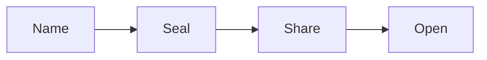
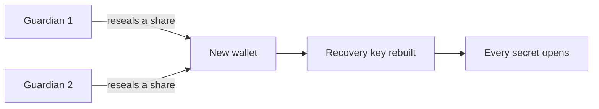

# How it works

Name a secret, seal it on your device, share it with the names you choose, and let each reader open
their own copy. Four steps, and each one is a few ENS records.



## Name

A secret is a subname under an ENS name you own, such as `openai.rewall.alice.eth`. A subname is a
name under a name, the way `alice.eth` sits under `eth`. The `rewall` label keeps every secret in
one place and leaves `openai.alice.eth` free for anything else.

The subname resolves through the one resolver your account owns. A resolver is the contract that
stores a name's records. Every record a secret needs lives on that resolver under the subname's namehash,
which is the fixed hash ENS makes from a full name. So one resolver holds every secret without them
colliding.

A name is public. Anyone can see that `openai.rewall.alice.eth` exists, so pick a label you do not
mind the world reading.

## Seal

The value is encrypted on your device under a random key. Only ciphertext reaches the chain.

The client makes a fresh random 32 byte key, called the data key. It pads the plaintext to a
multiple of 256 bytes, so every short credential comes out the same length. Then it encrypts with
AES-256-GCM, a standard authenticated cipher. The secret's own name is bound into the ciphertext as
authenticated data, so a blob copied onto another name refuses to open. A key commitment sits inside
the blob too, so exactly one key can ever open it. The result is written to the subname as
`rewall.blob`.

## Share

That key is sealed to each reader's public key and written as one record per reader.

Every participant publishes an X25519 public key under their name as `rewall.pubkey`. X25519 is the
key type libsodium uses to seal a message to one recipient. To share a secret, the client seals the
data key to a reader's public key with a libsodium sealed box and writes it as
`rewall.key.<fingerprint>`. The fingerprint is the first 8 bytes of the keccak256 hash of that
public key. Reading is a matter of holding a sealed copy, not of being on a list.

The owner signs the list of readers. Without that, anyone with write access to the records could add
a name of their own and wait for the next rotation to seal a key to it.

Two kinds of permission exist and they are not the same thing. Write permission is an ENS role
inside the owner's resolver. It is given on one secret with `authorizeNameRoles` or on one record
key with `authorizeTextRoles`, and it can be taken back. Read permission is only ever a sealed
copy. No role grants it and no role removes it. [Built on ENSv2](/ensv2) covers the roles.

## Open

A reader unseals their own copy with the key their wallet derives. Nobody else can.

The private key is never stored in plaintext. The reader's wallet signs one fixed message, the
signature is hashed, and the result is the X25519 secret key. With it the reader unseals their own
`rewall.key.<fingerprint>` record, recovers the data key, and decrypts the blob in memory. Before
any of that, the client checks that `rewall.v` is `3` and `rewall.enc` is `aes-256-gcm`, and refuses
anything else. There is no server that could hand out a copy.

Taking access back means rotating, which has [its own section](#taking-access-back) below.

## Your key

A wallet is the app that holds your Ethereum account and signs things for you. Rewall never asks it
for a private key. It asks for one signature over one fixed message.

The message is EIP-712 typed data, a format where the wallet shows each field by name. The SDK
holds it as `IDENTITY_TYPED_DATA` in `sdk/src/identity.ts`:

```
domain     name "Rewall", version "1"
type       Identity(string purpose,string warning)
purpose    Derive the X25519 key that unseals secrets shared with this wallet
warning    Sign this only in Rewall, whoever collects it reads every secret shared with you forever
```

The 65 byte signature is cut down to its 64 byte `r || s` form. The recovery byte is dropped and
`s` is folded into the low half of the curve order, so a wallet that returns a high `s` still yields
the same bytes. Those bytes are hashed with SHA-256, and the 32 byte hash is the X25519 secret key.
The public key is `crypto_scalarmult_base` of it. The same wallet always signs the same way, so the
same key comes back every time and nothing has to be saved.

The warning in the message is literal. The signature is the key. Anyone who collects it can read
every secret ever shared with that wallet, forever, and no rotation can take that back. The domain
carries no chain id, so one wallet has one identity on every network. Sign this message in Rewall
and nowhere else.

The key is never written to disk in plaintext. The SDK and the MCP server hold it in memory and
derive it again on the next run. The browser extension is the one exception. It keeps
the key in extension storage, wrapped under a passphrase by `extension/src/lock.ts`, because
filling a sign-in code cannot prompt your wallet every time. The
[extension page](/components/extension) spells out that trade.

MetaMask is the supported wallet, because its `eth_signTypedData_v4` always signs the same way. A
smart contract or MPC wallet does not, so it must use a generated key stored by the client.

## The records

Every record is an ENS text record, a small named string on a name. Keys are compared as raw bytes,
so `rewall.key.DEADBEEF` and `rewall.key.deadbeef` are different records. The names come from
`RECORD` in `sdk/src/records.ts`.

On a secret subname such as `openai.rewall.alice.eth`:

| Record             | What it holds                                                                  |
| ------------------ | ------------------------------------------------------------------------------ |
| `rewall.v`         | Schema version, `3`.                                                           |
| `rewall.type`      | One of `generic`, `apikey`, `privkey`, `totp` or `receipt`.                    |
| `rewall.enc`       | `aes-256-gcm`, checked on every read.                                          |
| `rewall.blob`      | The ciphertext in base64, nonce then key commitment then padded text then tag. |
| `rewall.cid`       | Reserved for off chain ciphertext, not used.                                   |
| `rewall.key.<fp>`  | The data key sealed to the reader whose fingerprint is `fp`.                   |
| `rewall.owner`     | The ENS name that owns this secret.                                            |
| `rewall.grantees`  | Names granted directly, comma separated.                                       |
| `rewall.subtrees`  | Names whose whole subtree was granted.                                         |
| `rewall.recovery`  | Recovery entries, each a name or `guardians:<owner name>`.                     |
| `rewall.holders`   | Fingerprints that currently hold a sealed copy.                                |
| `rewall.auth.n`    | A counter that goes up on every list change.                                   |
| `rewall.auth.keys` | Role, name and approved key fingerprint for every party on the lists.          |
| `rewall.auth.sig`  | The owner's signature over the lists, checked before any rotation.             |
| `rewall.site`      | One exact hostname, `totp` only. Not covered by the signature.                 |
| `rewall.allow`     | Allowed hosts, enforced by the MCP server.                                     |
| `rewall.created`   | Unix timestamp.                                                                |

On a participant name such as `alice.eth`:

| Record                   | What it holds                                                       |
| ------------------------ | ------------------------------------------------------------------- |
| `rewall.pubkey`          | The X25519 public key, base64.                                      |
| `rewall.index`           | Secret labels, kept on `rewall.alice.eth` and read by `list`.       |
| `rewall.subtree.pubkey`  | The team key, on a parent that shares with its subnames.            |
| `rewall.subtree.v`       | The team key version, bumped to remove a member.                    |
| `rewall.subtree.key`     | The team private key sealed to this subname, on each member.        |
| `rewall.guardians`       | Guardian names, comma separated.                                    |
| `rewall.guardian.<fp>`   | One share of the recovery key sealed to the guardian `fp`.          |
| `rewall.reshare.<fp>`    | A share re-sealed to a replacement key, on the guardian's own name. |
| `rewall.recovery.pubkey` | The public half of the guardian backed recovery key.                |
| `rewall.recovery.k`      | How many guardians are needed.                                      |
| `rewall.shielded`        | A shielded address for private payments, optional.                  |

The name lists exist because a fingerprint is a hash. Nothing can turn `rewall.key.<fp>` back into
a name, and text records cannot be listed, so a rotation needs the names to know who to re-seal for.
`rewall.holders` works the other way. It tells a rotation which sealed copies to clear.

## Taking access back

Revoke and rotate are the same operation. The client makes a new data key, encrypts the value again,
seals the new key to everyone who stays, and overwrites the records. The sealed copy of anyone
dropped is written as an empty value, which is how a record is removed. `rewall.auth.n` goes up and
the owner signs the new lists.

`revoke` needs to know which kind of access to remove, because one name can hold three kinds on
three different keys. No option removes a direct grant, `{ subtree: true }` removes a team grant,
and `{ recovery: true }` removes a recovery entry. Two refusals protect you. Removing a direct grant
from a name that is also a recovery entry is refused, since it would keep reading. Removing the
last recovery entry is refused, since every secret needs one.

Before anything is rotated, the client checks the signed lists. It recovers the signer of
`rewall.auth.sig` and compares it to the address that holds the name in its registry, the one thing
a write delegate cannot change. A list that fails to verify stops the rotation. So does a name whose
`rewall.pubkey` changed since it was approved, until the owner accepts the new key with
`reauthorize`.

Two limits remain. A write delegate can roll the records back to an older list the owner did sign,
because nothing on chain orders the counters. That can bring back a revoked reader, but it cannot
add a name the owner never approved. A delegate with write on `rewall.blob` can also overwrite the
value with a secret of their own, so delegate write only to someone you would trust with the
contents.

Revocation is forward only. The transaction that granted a name is in chain history with its sealed
copy, and so is the old blob. Anyone who held that key can decrypt the old value from an archive
node at any time. Rotation replaces the current value and cannot unpublish the old one. Treat a
grant as handing over a copy, and rotate the credential itself when someone leaves.

## Teams

A team is every subname under a name, such as `ci.alice.eth` and `deploy.alice.eth` under
`alice.eth`. Instead of sealing a secret to each member, the owner seals it once to a team key.

The parent derives the team key from its own secret key and a version number, so nothing extra is
stored. It publishes the public half as `rewall.subtree.pubkey` and the version as
`rewall.subtree.v`. Then it seals the private half to each member's `rewall.pubkey` and writes it on
that member as `rewall.subtree.key`. Members share the parent's resolver, so the whole team is
written in one transaction.

Granting a secret to the team seals the data key to the team public key. Each member opens
`rewall.subtree.key` with its own key, gets the team key, and opens the secret with that. Members
added later get the team key when the parent creates them.

Removing a member means bumping the version with `rewall.subtree.rotate()`. That changes the derived
key and makes every copy already handed out useless. The parent then runs
`rewall.subtree.distribute(members)` with the members who stay and grants each affected secret
again. Until then everyone is locked out. That is the price of keeping no state.

## Recovery

The SDK refuses to create a secret that only the owner can open. Every secret needs at least one
recovery entry, so losing a wallet can never lose the value.

The simplest recovery entry is a second ENS name backed by a cold wallet. The data key is sealed to
it on every create, like any other reader.

The stronger option is guardians. The client makes a fresh recovery key pair and splits the private
half into `n` shares with Shamir secret sharing. Any `k` shares rebuild it, and fewer reveal nothing.
Each share is sealed to one guardian's `rewall.pubkey` and stored on the owner's name as
`rewall.guardian.<fp>`, next to `rewall.guardians`, `rewall.recovery.pubkey` and
`rewall.recovery.k`. The recovery private key is then destroyed. Every secret is sealed to the
recovery public key, listed in `rewall.recovery` as `guardians:alice.eth`. `k` is at least 2, so no
guardian can recover alone, and a set holds at most 12.



When a wallet is lost, the owner makes a new one and derives a new key. Each guardian re-seals its
share to that key and publishes it on its own name as `rewall.reshare.<new fp>`. Publishing gives
nothing away, since only the new key can open it. The new wallet reads the guardian list, collects
those records, and tries sets of `k` shares until one rebuilds a key matching
`rewall.recovery.pubkey`. A stale or wrong share is skipped, not trusted. Then the owner publishes a
new `rewall.pubkey` and rotates every secret.

## What is public

Everything except the plaintext. A public chain has no private records, so the tables above are also
a list of what the world can see.

Public and unavoidable. That the secret exists, and its label. `stripe-key.rewall.alice.eth` says
that alice uses Stripe before anyone decrypts anything, so choose a label you do not mind showing. The
owner's address. The time of every grant, revoke and rotation, since each is a transaction.

Public today, closable later. The access graph, since `rewall.grantees`, `rewall.subtrees`,
`rewall.recovery`, `rewall.guardians` and `rewall.owner` are plain names. The reader set, since
anyone can hash a candidate's `rewall.pubkey` and look for that `rewall.key.<fp>` record, and
`rewall.holders` says it outright. The type and policy in `rewall.type`, `rewall.allow` and
`rewall.site`.

Already hidden. The plaintext length, since padding makes everything under 252 bytes look the same.
Which value a blob holds and which name it belongs to, both fixed by the key commitment and the
authenticated data.

All of this runs on the Sepolia test network today. Real credentials do not belong in it.
