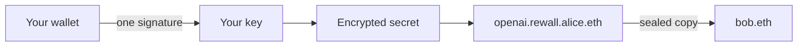

# Rewall

Secret storage with no server. A secret is encrypted on your machine and stored under your ENS name.
You share it by naming who may read it. You take it back by rotating. Nobody but the names you chose
can read it, and there is no account, no login and no company in the middle.

