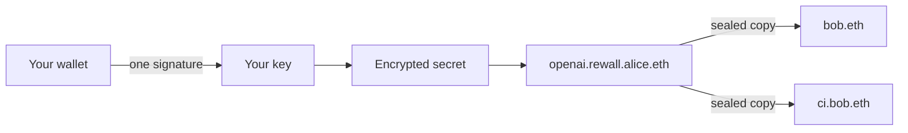

# Introduction

Rewall is a place to keep secrets that has no server. A secret is an API key, a password, a private
key, a two factor seed, anything you would rather nobody held for you. Rewall encrypts it in your
browser or on your machine. The encrypted result is stored under a name you own on ENS. You share it
by naming who may read it. You take it back by rotating. There is no account, no login and no
company in the middle.

Everything runs on Sepolia today. Sepolia is a test network for Ethereum. The coins on it have no
value and the names on it are for trying things out. Real credentials do not belong in it yet.

## The problem

Most secrets live in one of three places.

A `.env` file on a laptop. It is plaintext, it gets pasted into chat, and nobody knows how many
copies exist.

A password manager run by a company. It works until that company has an outage, changes its terms,
or is breached. You trust their servers with the one thing you did not want to hand to anyone.

A shared credential in a team. Someone leaves and the key they knew is still the key. Removing them
from a list does not remove what they already read.

## How Rewall is different

**No server.** Your browser or your machine does the encrypting and decrypting. The chain stores
only ciphertext, which is the encrypted form. There is nothing for Rewall to host and nothing for it
to read.

**No account.** You never sign up. You connect a wallet, which is a program that holds a key and can
sign messages. One signature from it becomes your encryption key. The dashboard keeps that key in
memory and never writes it anywhere. The browser extension is the one exception, and it stores the
key under a passphrase you choose.

**A name is the identity.** Every person, team or machine is an ENS name such as `alice.eth`. ENS is
the naming system on Ethereum. Each name publishes one public key as a text record called
`rewall.pubkey`. To share a secret with someone you need their name and nothing else.

**Taking access back is a rotation.** A secret is encrypted once under a random data key. That data
key is sealed to each reader's public key and written as one record per reader, named
`rewall.key.<fingerprint>`. Reading is not a permission anyone checks. You either hold a sealed copy
or you do not. So revoking means encrypting again under a new key and sealing it only for the people
who stay. The old copies open nothing new.

A secret lives at `<secret>.rewall.<name>.eth`, for example `openai.rewall.alice.eth`. The full
mechanism is on [How it works](/how-it-works).

## Who it is for

**People** who want one place for API keys, passwords and two factor codes that no company can lock
them out of.

**Teams** that share credentials and need to hand access to a whole group at once, then take it away
from one person without touching the others.

**Machines** such as build servers that need a secret at three in the morning with nobody at the
keyboard.

**AI agents** that should use a key without ever seeing it. The MCP server is a small program an AI
assistant calls for tools. It sends the request, attaches the secret, and returns the response with
the value removed.

## What runs where

Everything that touches your secret runs on your side. The one hosted piece is the MCP server at
`https://mcp.rewall.me/mcp`. It holds the key for a single demo vault and decrypts only what was
granted to that vault's name. Everyone who connects can use that vault.

- [SDK](/components/sdk). The TypeScript library everything else is built on. It derives your key,
  encrypts, seals to names, and reads and writes ENS.
- [Dashboard](/components/dashboard). The web app at [rewall.me](https://rewall.me). Store, share,
  revoke, recover, hold 2FA accounts and send private payments, all from a browser.
- [MCP server](/components/mcp). Lets an AI agent use a secret without reading it. A hosted copy
  answers at `https://mcp.rewall.me/mcp`.
- [Browser extension](/components/extension). Fills sign-in codes from 2FA secrets stored under your
  name, on the exact site each one belongs to.
- [Ledger Key Ring](/components/ledger). Enrols a server into a Ledger Key Ring with a human pressing
  the button on the device. Optional hardening.
- [Chainlink CRE](/components/cre). A workflow that opens a Rewall secret inside a secure enclave and
  returns only a digest.
- [Tools](/components/tools). Scripts that set up the test names on Sepolia and prove each feature
  against the real chain.
- [Transfer rail](/components/rail). A local copy of the private payment service, for testing only.
  Not part of Rewall.

## What it stands on

Rewall is built on ENSv2, the new version of ENS. ENSv2 provides the names, the registries that say
who owns them, and the resolvers that hold the records. A secret is a set of ENS text records and
nothing else. See [Built on ENSv2](/ensv2).

Two partners appear in specific components. Chainlink provides the CRE runtime the enclave workflow
runs in and the private transfer service the payments build on. Ledger provides the Key Ring that
the enrolment component joins. The page for each says plainly what is real and what is simulated
today. The enclave is simulated locally, the Ledger device is emulated, and the payment service runs
as a local stand in. See [Built with](/built-with).

## Where to go next

- [Get started](/get-started) walks through the dashboard from the first click.
- [How it works](/how-it-works) explains name, seal, share and open.
- [Examples](/examples) are eight short programs, one per feature.
- [FAQ](/faq) answers the questions people ask first.
- The source is at [github.com/oynozan/rewall](https://github.com/oynozan/rewall).
